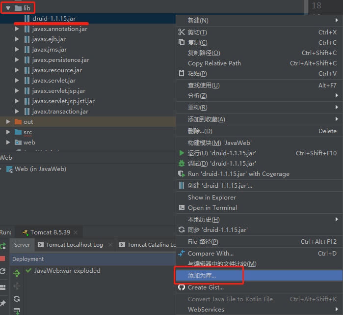

# Druid连接池

## 介绍

Druid是阿里巴巴数据库事业部出品，为监控而生的数据库连接池，Java语言中最好的数据库连接池。Druid能够提供强大的监控和扩展功能。

## 下载

[maven中央仓库 ](http://central.maven.org/maven2/com/alibaba/druid/)

[GitHub](https://github.com/alibaba/druid)

 [本站下载](/wp-content/uploads/2019/07/druid-1.1.15.rar)

## 导入



## 配置

```java
// 在src下创建一个配置文件 druid.properties
// 写入一些数据库的基本数据
driverClassName=com.mysql.jdbc.Driver
url=jdbc:mysql://127.0.0.1:3306/school
username=root
password=123
```


## 使用

### 写一个最简单查询

```java
try {
    // 加载配置文件
    Properties p = new Properties();
    p.load(JDBC.class.getClassLoader().getResourceAsStream("druid.properties"));
    // 获取连接池对象
    DataSource ds = DruidDataSourceFactory.createDataSource(p);
    // 获取连接
    Connection con = ds.getConnection();
    // 创建Statement方法
    Statement st = conn.createStatement();
    // 定义SQL语句
    String sql = "SELECT * FROM student";
    // 执行语句
    ResultSet res = st.executeQuery(sql);
    // 一次获取一条,通过循环输出所有
    while(res.next()){
        System.out.println(res.getString("name"));
    }
} catch (IOException e) {
    e.printStackTrace();
} catch (Exception e) {
    e.printStackTrace();
}
```

