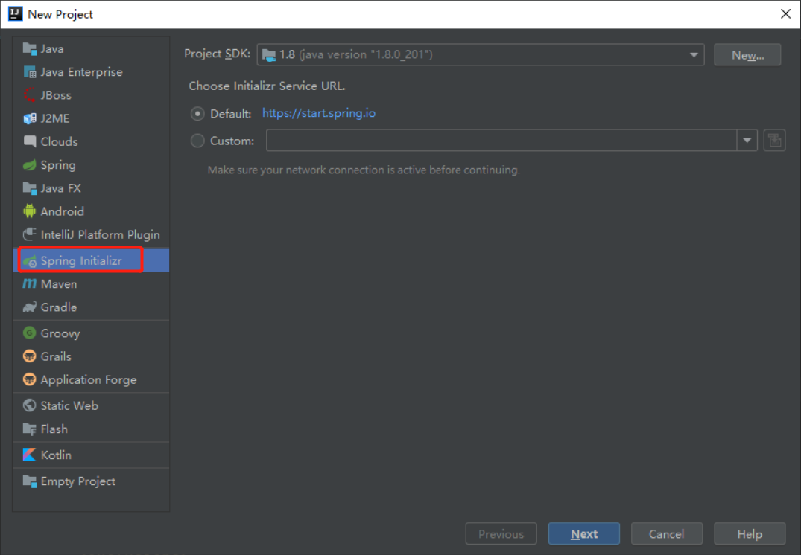

## 1. 快速创建SpringBoot项目

在**IEDA**中只需点击**New Project**选择**Spring Initializr**随后填写相应项目名称即可快速创建




## 2. 第一个Hello World

```java
package cn.lksun.springboot.Controller;

import org.springframework.stereotype.Controller;
import org.springframework.web.bind.annotation.RequestMapping;
import org.springframework.web.bind.annotation.RequestMethod;
import org.springframework.web.bind.annotation.ResponseBody;

@Controller
@ResponseBody
public class HelloWorldController {
    @RequestMapping(value = "/",method = RequestMethod.GET)
    public static String index() {
        return "Hello Spring boot !";
    }

}
```

因为SpringBoot已经内置了Apache的WEB服务，所以无需单独配置。

此时我们在浏览器中访问`localhost:8080`就可以看到了。

**但是问题来了：**我的电脑已经运行了PHP环境80端口已被占用，所以接下来要修改SpringBoot的配置


## 3.配置文件

### 常用的配置方式

- 核心配置文件
  - application.properties
  - application.yml
- 命令行参数
- OS环境变量
- Dev属性

### application.properties

```
# mybatis配置
spring.datasource.url=jdbc:mysql://localhost:3306/lksun
spring.datasource.username=root
spring.datasource.password=root
spring.datasource.driver-class-name=com.mysql.jdbc.Driver

# tomcat配置
server.port=8888

# 自定义
lksun.site.name=Lksun
lksun.site.address=lksun.cn

# List
lksun.article[0]=xxx
lksun.article[1]=xxx
lksun.article[2]=xxx
lksun.article[3]=xxx

# Map
lksun.user.id=1
lksun.user.name=xiaoming
lksun.user.age=18

# 甚至可以定义一个随机数
lksun.site.id=${random.int}
```

### application.yml

