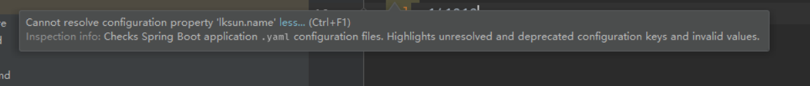

## 1. 快速创建SpringBoot项目

在**IEDA**中只需点击**New Project**选择**Spring Initializr**随后填写相应项目名称即可快速创建


## 2. 第一个Hello World

```java
package cn.lksun.springboot.Controller;

import org.springframework.stereotype.Controller;
import org.springframework.web.bind.annotation.RequestMapping;
import org.springframework.web.bind.annotation.RequestMethod;
import org.springframework.web.bind.annotation.ResponseBody;

@Controller
@ResponseBody
public class HelloWorldController {
    @RequestMapping(value = "/",method = RequestMethod.GET)
    public static String index() {
        return "Hello Spring boot !";
    }

}
```

因为SpringBoot已经内置了Apache的WEB服务，所以无需单独配置。

此时我们在浏览器中访问`localhost:8080`就可以看到了。

**但是问题来了：**我的电脑已经运行了PHP环境80端口已被占用，所以接下来要修改SpringBoot的配置


## 3.配置文件

### 常用的配置方式

- 核心配置文件
  - application.properties
  - application.yml
- 命令行参数
- OS环境变量
- Dev属性

### application.properties

```
# mybatis配置
spring.datasource.url=jdbc:mysql://localhost:3306/lksun
spring.datasource.username=root
spring.datasource.password=root
spring.datasource.driver-class-name=com.mysql.jdbc.Driver

# tomcat配置
server.port=8888

# 自定义
lksun.site.name=Lksun
lksun.site.address=lksun.cn

# List
lksun.article[0]=xxx
lksun.article[1]=xxx
lksun.article[2]=xxx
lksun.article[3]=xxx

# 甚至可以定义一个随机数
lksun.site.id=${random.int}
```

### application.yml

```yaml
server:
  port: 1244
spring:
    datasource:
      url : jdbc:mysql://localhost:3306/lksun
      username : root
      password : root
      driver-class-name : com.mysql.jdbc.Driver
  redis:
    database: 0
    host: 127.0.0.1
    port: 6379
    password: 123456
lksun:
  name: lksun
  age: 18
  sex: boy
  lists:
    - HW
    - Mi
    - Apple
    - 1+
  maps: {key1: xiaowang,key2: wangwu}
  dog:
    name: wangcai
    age: 8


```


### 获取参数

```java
package cn.lksun.springboot.Domain;

import org.springframework.beans.factory.annotation.Value;
import org.springframework.boot.context.properties.ConfigurationProperties;
import org.springframework.stereotype.Component;
import java.lang.reflect.Array;
import java.util.List;
import java.util.Map;

@Component
@ConfigurationProperties(prefix = "lksun")
public class Lksun {

    private String name;
    private String age;
    private String sex;
    private List<Object> lists;
    private Map<String,Object> maps;
    private Dog dog;
    // 此处还可以这样
    @Value("${server.port}")
    private Integer port;

    @Override
    public String toString() {
        return "Lksun{" +
                "name='" + name + '\'' +
                ", age='" + age + '\'' +
                ", sex='" + sex + '\'' +
                ", lists=" + lists +
                ", maps=" + maps +
                ", dog=" + dog +
                ", port='" + port + '\'' +
                '}';
    }

    public Integer getPort() {
        return port;
    }

    public void Integer(Integer port) {
        this.port = port;
    }

    public String getName() {
        return name;
    }

    public Dog getDog() {
        return dog;
    }

    public void setDog(Dog dog) {
        this.dog = dog;
    }

    public void setName(String name) {
        this.name = name;
    }

    public String getAge() {
        return age;
    }

    public void setAge(String age) {
        this.age = age;
    }

    public String getSex() {
        return sex;
    }

    public void setSex(String sex) {
        this.sex = sex;
    }

    public List<Object> getLists() {
        return lists;
    }

    public void setLists(List<Object> lists) {
        this.lists = lists;
    }

    public Map<String, Object> getMaps() {
        return maps;
    }

    public void setMaps(Map<String, Object> maps) {
        this.maps = maps;
    }

}

```


### 可能出现的问题

- 编译器报错或无法运行

  

  或者

  **spring boot Configuration Annotation Proessor not found in classpath**

  **解决方法：**

  ```xml
  <!-- pox.xml中加入 -->
  <dependency>
      <groupId>org.springframework.boot</groupId>
      <artifactId>spring-boot-configuration-processor</artifactId>
      <optional>true</optional>
  </dependency>
  ```


