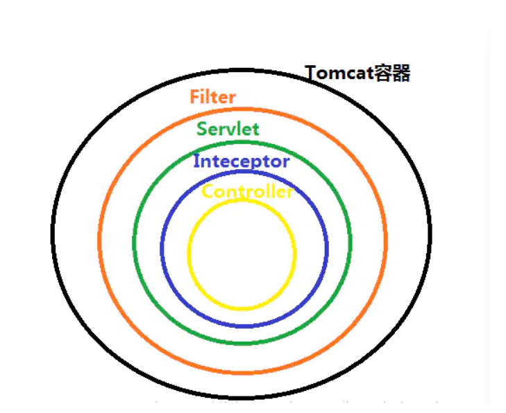
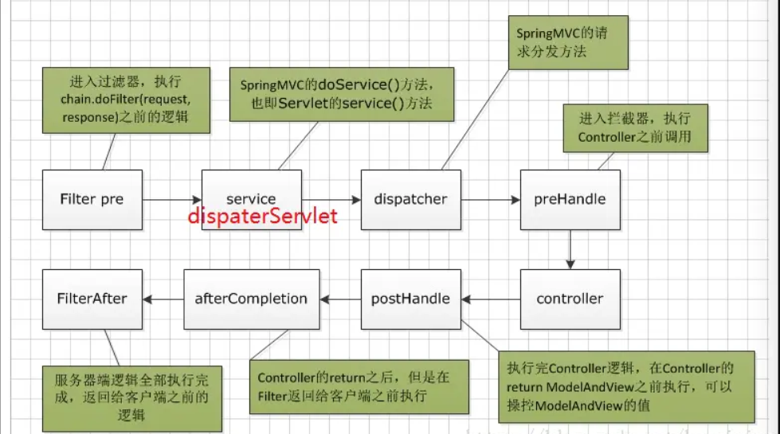

## 什么是过滤器

过滤器，依靠servlet技术。Java Servlet 是运行在 Web 服务器或应用服务器上的程序，它是作为来自 Web 浏览器或其他 HTTP 客户端的请求和 HTTP 服务器上的数据库或应用程序之间的中间层。

过滤器Filter，是Servlet的的一个实用技术了。可通过过滤器，对请求进行拦截，比如读取session判断用户是否登录、判断访问的请求URL是否有访问权限(黑白名单)等。**主要还是可对请求进行预处理**（此处给我的感觉有点像Laravel中的中间件 - Middleware）。

说到这不得不讲到类似于过滤器的**拦截器**[相关文章随后补上]：

- 过滤器和拦截器触发时机不一样，过滤器是在请求进入容器后，但请求进入servlet之前进行预处理的。请求结束返回也是，是在servlet处理完后，返回给前端之前。
- 拦截器可以获取IOC容器中的各个bean，而过滤器就不行，因为拦截器是spring提供并管理的，spring的功能可以被拦截器使用，在拦截器里注入一个service，可以调用业务逻辑。而过滤器是JavaEE标准，只需依赖servlet api ，不需要依赖spring。






## 使用

我在项目中创建一个`Filter`目录并在其中创建一个`AuthFilter`类

说关键的几点：

- 继承`Filter`接口并实现`init`、`doFilter`、`destroy`三个类
- 添加注解 `@WebFilter(filterName = "authFilter", urlPatterns = {"/*"})` ，设置过滤器名称和过滤的路由
- 核心代码写在`doFilter`中

```java
@Override
public void doFilter(ServletRequest servletRequest, ServletResponse servletResponse, FilterChain filterChain) throws IOException, ServletException {
    // 这样请求所有路由或视图时控制台都会输出Hello
    System.out.println("Hello"); 
    // 这条不能少否则浏览器就没有东西输出了
    filterChain.doFilter(servletRequest, servletResponse);
}
```


## Filter过滤器实现登录功能

[SpringBoot中使用Filter过滤器实现登录功能.md](./SpringBoot中使用Filter过滤器实现登录功能.md)