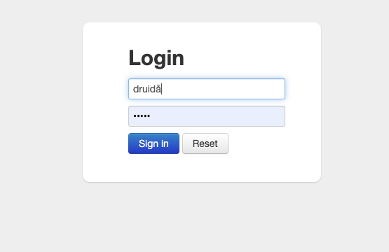
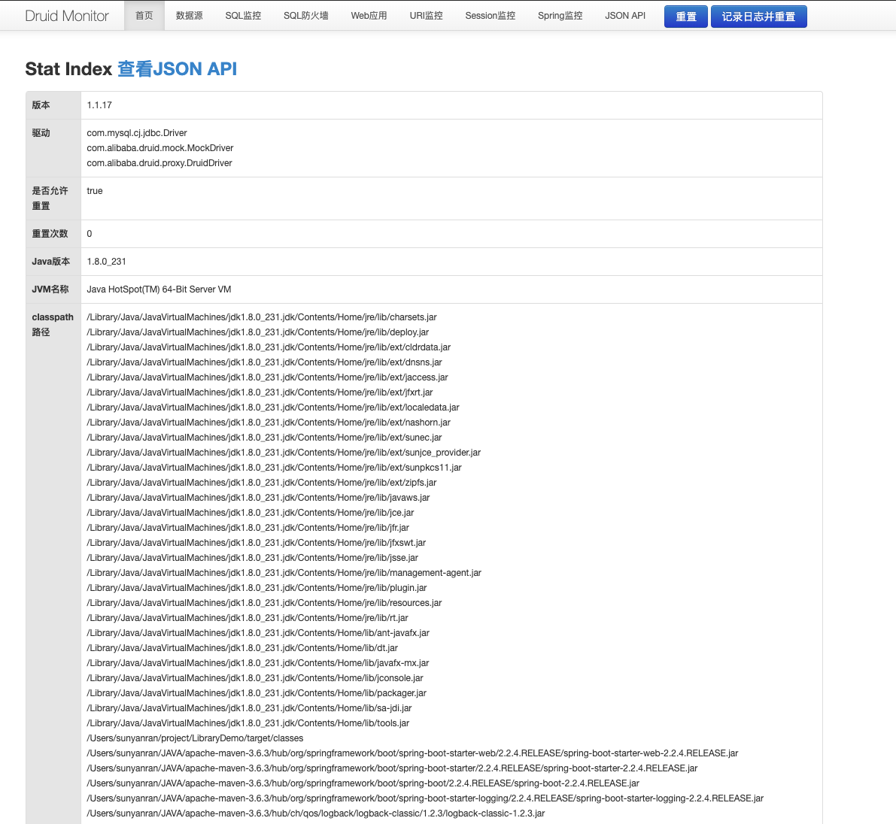

## 简介

Druid是一个专为大型数据集上的高性能切片和OLAP分析而设计的数据存储。Druid最常用作为GUI分析应用程序提供动力的数据存储，或者用作需要快速聚合的高度并发API的后端。

Druid官方github号称**Druid是Java语言中最好的数据库连接池。Druid能够提供强大的监控和扩展功能。**

阿里巴巴出品	

## 导入Jar包

```xml
<properties>
  <java.version>1.8</java.version>
  <druid.version>1.1.17</druid.version>
</properties>

<!-- Druid -->
<dependency>
  <groupId>com.alibaba</groupId>
  <artifactId>druid-spring-boot-starter</artifactId>
  <version>${druid.version}</version>
</dependency>
```


## 配置

```yml
spring:
  datasource:
      username: root
      password: root
      url: jdbc:mysql://127.0.0.1:3306/demo
      driver‐class‐name: com.mysql.jdbc.Driver
      type: com.alibaba.druid.pool.DruidDataSource  # 修改配置源
      schema:
        - classpath:data.sql    # 构建数据
      initialization-mode: always
      druid:
        stat-view-servlet:
          enabled: true   # 开启 默认false
          url-pattern:
            - /druid/*    # 监控的地址
          login-username: druid	
          login-password: druid
```


**更多配置信息：https://github.com/alibaba/druid/tree/master/druid-spring-boot-starter**


## 查看监控页面

访问**127.0.0.1:8989/druid** 



按照配置登录后




## 其他

**我出现的问题**：

- 因为之前配置了登录相关的过滤器会导致直接跳到/login界面

