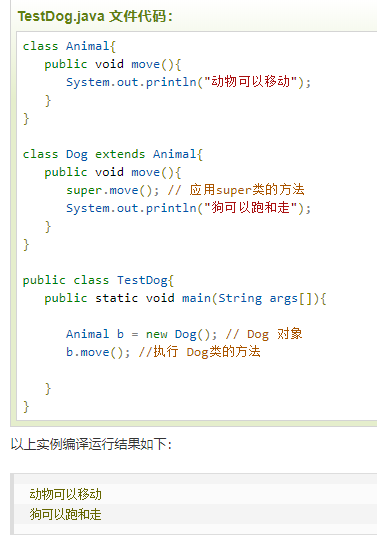
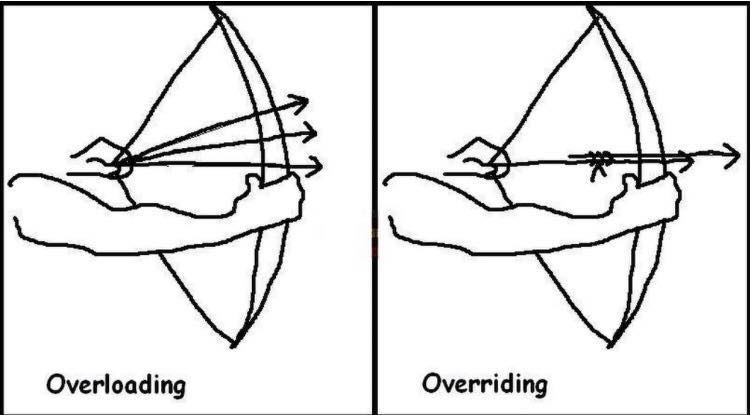

- ## 方法的重写

  - **重写规则**
    - 参数列表必须完全与被重写方法的相同；
    - 返回类型必须完全与被重写方法的返回类型相同；
    - 访问权限不能比父类中被重写的方法的访问权限更低。例如：如果父类的一个方法被声明为public，那么在子类中重写该方法就不能声明为protected。
    - 父类的成员方法只能被它的子类重写。
    - 声明为final的方法不能被重写。
    - 声明为static的方法不能被重写，但是能够被再次声明。
    - 子类和父类在同一个包中，那么子类可以重写父类所有方法，除了声明为private和final的方法。
    - 子类和父类不在同一个包中，那么子类只能够重写父类的声明为public和protected的非final方法。
    - 重写的方法能够抛出任何非强制异常，无论被重写的方法是否抛出异常。但是，重写的方法不能抛出新的强制性异常，或者比被重写方法声明的更广泛的强制性异常，反之则可以。
    - 构造方法不能被重写。
    - 如果不能继承一个方法，则不能重写这个方法。

- ## Super关键字的使用

  - 当需要在子类中调用父类的被重写方法时，要使用super关键字。
    - 
    - 如同PHP中 parentparent::__construct()，调用父类构造函数

- ## 重载(Overload)

  * 重载(overloading) 是在一个类里面，方法名字相同，而参数不同。返回类型可以相同也可以不同。每个重载的方法（或者构造函数）都必须有一个独一无二的参数类型列表。最常用的地方就是构造器的重载。

  * **重载规则:**

    * 被重载的方法必须改变参数列表(参数个数或类型不一样)；

    * 被重载的方法可以改变返回类型；
    * 被重载的方法可以改变访问修饰符；
    * 被重载的方法可以声明新的或更广的检查异常；
    * 方法能够在同一个类中或者在一个子类中被重载。
    * 无法以返回值类型作为重载函数的区分标准。

- **总结**

  - **区别**  

| 区别点   | 重载     | 重写                                            |
| -------- | -------- | ----------------------------------------------- |
| 参数列表 | 必须修改 | 不一定修改                                      |
| 返回类型 | 可以修改 | 不一定修改                                      |
| 异常     | 可以修改 | 可以减少或者删除,一定不能抛出新的或者更广的异常 |
| 访问     | 可以修改 | 一定不能做更严格的限制（可以降低限制）          |

-    方法的重写(Overriding)和重载(Overloading)是java多态性的不同表现，重写是父类与子类之间多态性的一种表现，重载可以理解成多态的具体表现形式。

  * 方法重载是一个类中定义了多个方法名相同,而他们的参数的数量不同或数量相同而类型和次序不同,则称为方法的重载。

  - 方法重写是在子类存在方法与父类的方法的名字相同,而且参数的个数与类型一样,返回值也一样的方法,就称为重写。
  - 方法重载是一个类的多态性表现,而方法重写是子类与父类的一种多态性表现。

- **参考**

  - <http://www.runoob.com/java/java-override-overload.html>  菜鸟教程(Java 重写(Override)与重载(Overload))