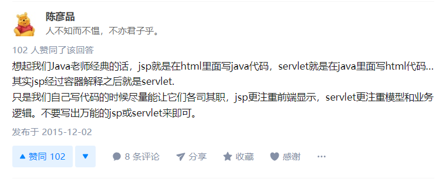

# 结合Laravel去理解Servlet和JSP


## 前言

学习JAVA也有半个月了一不小心把基础学完了，按照学习路线该学习JavaWeb相关的了也就是Servlet和Jsp部分。

在搭建好TomCat后配合idea的一键创建项目，一个`index.jsp`出现了，

配置好WEB服务后访问`http://127.0.0.1:8888`，`Jsp Test`出现在浏览器中。

好像一切都很顺利但是...突然不知道servlet和jsp到底有什么区别，有什么样的关系...

一顿搜索后仿佛知道了其中的奥秘

结合Laravel说一下自己的理解


## 开始

### 首先放两段Laravel的代码

```php
# 不要考虑是否可以执行或者语法错误,我屏蔽了一些关键字  

<div class="panel margin-large-top">
    <div class="panel-head bg-main">
        <h2>
            @if($setting->get('xxx') == App\Setting::ON)
            <a class="tag bg-dot " target="_blank" href="{{ route('xxx.create',['id'=>$id]) }}">
                xxx
            </a>
            @endif
        </h2>
    </div>
    <ul class="list-group">
        @if(!empty($xxx))
            @foreach($xxx as $xxx)
            <li>
                <a href="{{ route('xxx.show',['id'=>$xxx['id']]) }}" target="_blank">
                    {{$xxx['title']}}
                </a>
            </li>
            @endforeach
        @else
            <li>
                <a href="{{ route('xxx.create',['id'=>$id]) }}" target="_blank">
                   XXXX 
                </a>
            </li>
        @endif
    </ul>
</div>
                           
# 这是一段存放在 /resources/views/xxx/xxx.blade.php 的文件
# 使用过Laravel并不陌生,这就是我们常说的MVC中的V(view) 视图
# 除了HTML代码外还有一些像PHP又不是PHP的代码(或者叫关键字?)

```


```php
# 同样对关键字做了处理

<div class="panel margin-large-top">
    <div class="panel-head bg-main">
        <h2>xxx
            <?php if($setting->get('xxx') == App\Setting::ON): ?>
            <a class="tag bg-dot" target="_blank" href="<?php echo e(route('xxx.create',['id'=>$id])); ?>">
                xxxx
            </a>
            <?php endif; ?>
        </h2>
    </div>
    <ul class="list-group">
        <?php if(!empty($xxxs)): ?>
            <?php $__currentLoopData = $xxxs; $__env->addLoop($__currentLoopData); foreach($__currentLoopData as $xxx): $__env->incrementLoopIndices(); $loop = $__env->getLastLoop(); ?>
            <li>
                <a href="<?php echo e(route('xxx.show',['id'=>$xxx['id']])); ?>" target="_blank">
                    <?php echo e($xxx['title']); ?>

                </a>
            </li>
            <?php endforeach; $__env->popLoop(); $loop = $__env->getLastLoop(); ?>
        <?php else: ?>
            <li>
                <a href="<?php echo e(route('xxx.create',['id'=>$id])); ?>" target="_blank">xxxxx</a>
            </li>
        <?php endif; ?>
    </ul>
</div>
            
# 这是存放在 /storage/framework/views/0e24a847b210e4f5770ae3f5159a6d8e79e349e3.php
# 这段代码可能就不是所有人都知道了,但是本质和第一段还是一样的,可以做下对比
# 因为第二段是由第一段转换而来的
# 然后由此文件配合Controller进行处理 直到渲染到浏览器
```


### 然后来看看Servlet和JSP

#### 基本概念：

> Servlet其实就是一个**遵循Servlet开发的java类**。
>
> Servlet是**由服务器调用的**，**运行在服务器端**。

> JSP全名为Java Server Pages，java服务器页面。
>
> JSP是一种基于文本的程序，其特点就是**HTML代码掺杂着JAVA代码**


#### 来自知乎网友一段通俗易懂的介绍：

