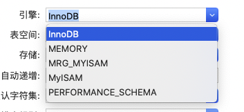

## 什么是数据库引擎：

>  **数据库引擎**是用于存储、处理和保护数据的核心服务。利用数据库引擎可控制访问权限并快速处理事务，从而满足企业内大多数需要处理大量数据的应用程序的要求。 使用数据库引擎创建用于联机事务处理或联机分析处理数据的关系数据库。这包括创建用于存储数据的表和用于查看、管理和保护数据安全的数据库对象（如索引、视图和存储过程）。  
>
> 引用自[百度百科](https://baike.baidu.com/item/数据库引擎)

## MySQL中的数据库引擎

- **InnoDB**
- **MyISAM**
- **MRG_MYISAM**
- **MEMORY**
- **PERFORMANCE_SCHEMA**

## 如何选择引擎

- 如果是可视管理软件：

  如在**Navicat**中可以直接在**设计表 **=> **选项** => **引擎** 选择相应的

  


- 如果是**SQL**语句则：

  ```sql
  ENGINE = MyISAM
  ```


## 差异

在日常中最常用的就是**InnoDB**和**MyISAM**，主要介绍这两个。

总结了一个表格

|                        |             **InnoDB**             |                    **MyISAM**                    |
| :--------------------: | :--------------------------------: | :----------------------------------------------: |
|        默认引擎        |          MySQL 5.5 版本后          |                 MySQL 5.5 版本前                 |
|          事务          |              **支持**              |                      不支持                      |
|           锁           |       最小的锁粒度是**行锁**       |              最小的锁粒度是**表锁**              |
|        全文索引        |  **支持 **FULLTEXT类型的全文索引   |           **不支持**，但是可以通过插件           |
|          主键          |            允许没有主键            | **必须有主键**，如果没有设置主键也会自己偷摸设置 |
|          外键          |              **支持**              |                      不支持                      |
|      表的具体行数      | 会保存总行数的字段，需要时直接调用 |                需要每次扫描整张表                |
|        数据恢复        |            无法安全恢复            |               支持崩溃后的安全恢复               |
| delete from table 操作 | 逐行删除(建议使用 truncate table)  |                    重新建立表                    |
|        **总结**        |      适用于**写操作多**的应用      |             适用于**读操作多**的应用             |


