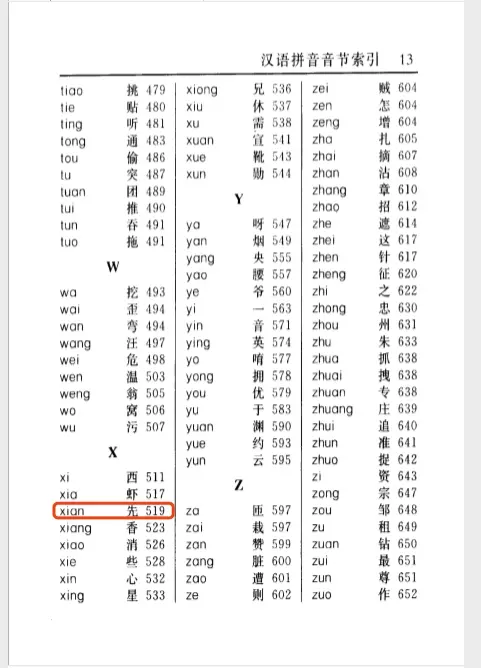
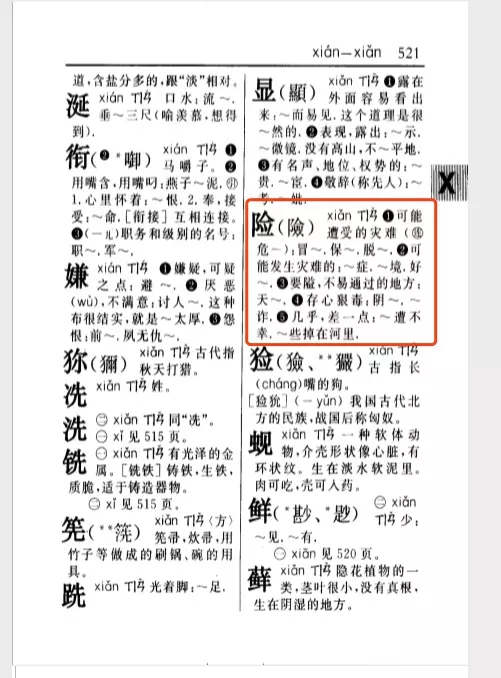
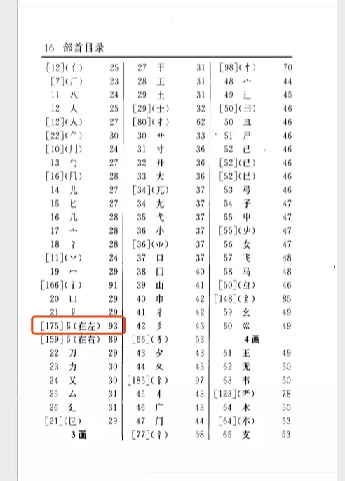
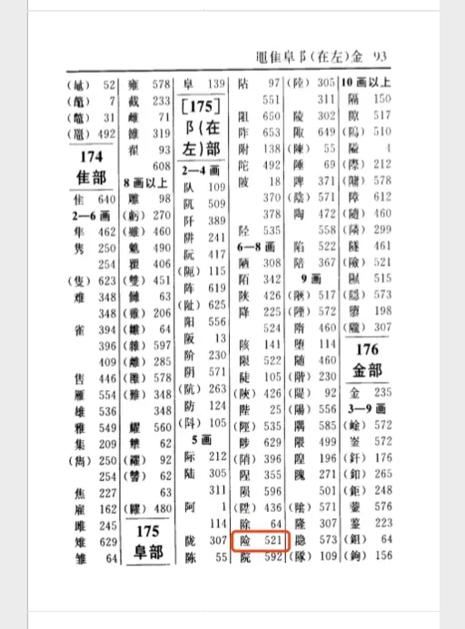
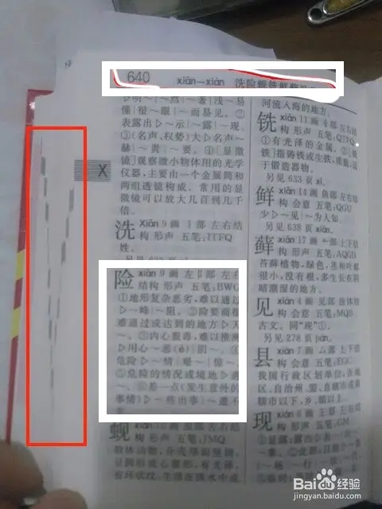

数据库索引是什么？新华字典来帮你

学过服务器端开发的朋友一定知道，程序没有数据库索引也可以运行。但是所有学习数据库的资料、教程，一定会有大量的篇幅在介绍数据库索引，各种后端开发工作的面试也一定绕不开索引，甚至可以说数据库索引是从后端初级开发跨越到高级开发的屠龙宝刀，那么索引到底在服务端程序中起着怎样的作用呢？

这篇文章是一系列数据库索引文章中的第一篇，这个系列包括了下面四篇文章：

1. [数据库索引是什么？新华字典来帮你](https://juejin.im/post/5c67be206fb9a049b13ebdbe#) —— 理解
2. [数据库索引融会贯通](https://juejin.im/post/5c67becf6fb9a049a42f9420) —— 深入
3. [20分钟数据库索引设计实战](https://juejin.im/post/5c67bf296fb9a049a81fdbde) —— 实战
4. [数据库索引为什么用B+树实现？](https://juejin.im/post/5c67bf756fb9a049e4133cd9) —— 扩展

这一系列涵盖了数据库索引从理论到实践的一系列知识，一站式解决了从理解到融会贯通的全过程，相信每一篇文章都可以给你带来更深入的体验。

## 什么是数据库索引？

用一句话来描述：**数据库索引就是一种加快海量数据查询的关键技术**。现在还不理解这句话？不要紧，往下看，20分钟以后你就能自己做出这样的总结来了。

首先给大家看一张图片

这本书大家一定都很熟悉，小学入门第一课一定就是教小朋友们学习如何使用这本书。那这和我们的数据库索引有啥关系呢？别着急，我们翻开第一页看看。

请大家注意右上角的那一排文字，原来目录就是传说中的索引呀！从前面的“一句话描述”我们可以知道，索引的目的就是为了加快数据查询。那么我们查字典时翻的第一个地方是哪里呢，我相信大部分人都会先翻到拼音目录，毕竟现在很多人都是提笔忘字了😂。

数据库索引的作用和拼音目录是一样的，就是最快速的锁定目标数据所在的位置范围。比如我们在这里要查`险`这个字，那么我们找到了`Xx`部分之后就能按顺序找到`xian`这个拼音所在的页码，根据前后的页码我们可以知道这个字一定是在519页到523页之间的，范围一下子就缩小到只有4页了。这相比我们从头翻到尾可是快多了，这时候就出现了第一个专业术语——**全表扫描**，也就是我们说的从头找到尾了。

果然，我们在第521页找到了我们要找的“险”字。

那么现在我们就知道数据库索引大概是一个什么东西了：数据库索引是一个类似于目录这样的用来加快数据查询的技术。

##  什么是联合索引？

相信大家都见过一些包含多个字段的数据库索引，比如`INDEX idx_test(col_a, col_b)`。这种包含多个字段的索引就被称为**“联合索引”**。那么在多个字段上建索引能起到什么样的作用呢？下面还是以新华字典为例，来看看到底什么是联合索引。

新华字典里还有一种目录被称为“部首目录”，下面可以看到，要使用这个目录我们首先会根据部首的笔画数找到对应该能的部分，然后可以在里面找到我们想找的部首。比如如果我们还是要找`险`字所在的位置：

找到部首后，右边的页码还不是`险`字真正的页码，我们还需要根据右边的页码找到对应部首在检字表中的位置。找到第93页的检字表后我们就可以根据`险`字余下的笔画数（7画）在“6-8画”这一部分里找到`险`字真正的页码了。

在这个过程中，我们**按顺序**使用了“两个目录”，一个叫做“部首目录”，一个叫做“检字表”。并且我们可以看到上图中检字表的内容都是按部首分门别类组织的。这两个部分合在一起就是我们在本节讨论的主题——**联合索引**。即通过第一个字段的值（部首）在第一级索引中找到对应的第二级索引位置（检字表页码），然后在第二级索引中根据第二个字段的值（笔画）找到符合条件的数据所在的位置（`险`字的真正页码）。

##  最左前缀匹配

从前面使用部首目录的例子中可以看出，如果我们不知道一个字的部首是什么的话，那基本是没办法使用这个目录的。这说明仅仅通过笔画数（第二个字段）是没办法使用部首目录的。

这就引申出了联合索引的一个规则：联合索引中的字段，只有某个字段（笔画）左边的所有字段（部首）都被使用了，才能使用该字段上的索引。例如，有索引`INDEX idx_i1(col_a, col_b)`，如果查询条件为`where col_b = 1`，则无法使用索引`idx_i1`。

但是如果我们知道部首但是不知道笔画数，比如不知道“横折竖弯勾”是算一笔还是两笔，那我们仍然可以使用“部首目录”部分的内容，只是要把“检字表”对应部首里的所有字都看一遍就能找到我们要找的字了。

这就引申出了联合索引的另一个规则：联合索引中的字段，即使某个字段（部首）右边的其他字段（笔画）没有被使用，该字段之前（含）的所有字段仍然可以正常使用索引。例如，有索引`INDEX idx_i2(col_a, col_b, col_c)`，则查询条件`where col_a = 1 and col_b = 2`在字段`col_a`和`col_b`上仍然可以走索引。

但是，如果我们在确定部首后，不知道一个字到底是两画还是三画，这种情况下我们只需要在对应部首的两画和三画部分中找就可以了，也就是说我们仍然使用了检字表中的内容。所以，使用范围条件查询时也是可以使用索引的。

最后，我们可以完整地表述一下**最左前缀匹配**原则的含义：对于一个联合索引，如果有一个SQL查询语句需要执行，则只有从索引最左边的第一个字段开始到**SQL语句查询条件**中不包含的字段（不含）或**范围条件**字段（含）为止的部分才会使用索引进行加速。

这里出现了一个之前没有提到的点，就是**范围条件字段也会结束对索引上后续字段的使用**，这是为什么呢？具体原因的解释涉及到了更深层次的知识，在接下来的第二篇文章的最后就可以找到答案。

##  什么是聚集索引？

从上文的部首目录和拼音目录同时存在但是实际的字典内容只有一份这一点上可以看出，在数据库中一张表上是可以有多个索引的。那么不同的索引之间有什么区别呢？

我们在新华字典的侧面可以看到一个V字形的一个个黑色小方块，有很多人都会在侧面写上`A, B, C, D`这样对应的拼音字母。因为字典中所有的字都是按照拼音顺序排列的，有时候直接使用首字母翻开对应的部分查也很快。

像拼音目录这样的索引，数据会根据索引中的顺序进行排列和组织的，这样的索引就被称为**聚集索引**，而**非聚集索引**就是其他的一般索引。因为数据只能按照一种规则排序，所以一张表至多有一个聚集索引，但可以有多个非聚集索引。

在MySQL数据库的`InnoDB`存储引擎中，主键索引就是聚集索引，所有数据都会按照主键索引进行组织；而在`MyISAM`存储引擎中，就没有聚集索引了，因为MyISAM存储引擎中的数据不是按索引顺序进行存储的。

## 感谢

转自[掘金 - **兜里有辣条**](https://juejin.im/post/5c67be206fb9a049b13ebdbe)