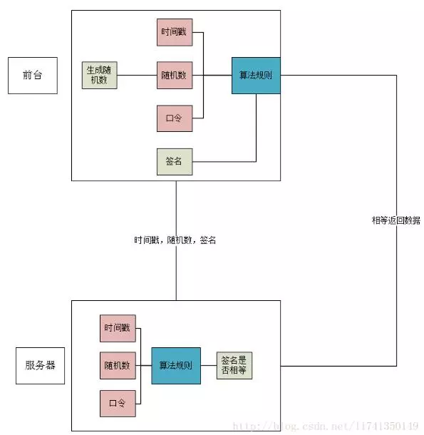

#	Api接口安全验证的实例

##	方法一 (初级)


> ​	返回的数据一般分为**xml**和**json**两种情况,在这个过程中，服务器并不知道请求的来源是什么，可能被用户非法调用偷取数据。

### 验证原理



###	原理

从图中可以看得很清楚，前台想要调用接口，需要使用几个参数生成签名。

时间戳：当前时间

随机数：随机生成的随机数

口令：前后台开发时，一个双方都知道的标识，相当于暗号

算法规则：商定好的运算规则，上面三个参数可以利用算法规则生成一个签名。

前台生成一个签名，当需要访问接口的时候，把时间戳，随机数，签名通过URL传递到后台。后台拿到时间戳，随机数后，通过一样的算法规则计算出签名，然后和传递过来的签名进行对比，一样的话，返回数据。


### 算法规则

在前后台交互中，算法规则是非常重要的，前后台都要通过算法规则计算出签名，至于规则怎么制定，看你怎么高兴怎么来。


### 参考

[PHP自学中心 - 微信公众号](https://mp.weixin.qq.com/s?__biz=MzIxMDA0OTcxNA==&mid=2654257218&idx=1&sn=2f39f300d33b62f643ed9aee27ef9576&chksm=8caaef9fbbdd66896836300e8aea73ac1f780c2ac742ce5b2e8fff9c4a52a4e7ad421c4103df&mpshare=1&scene=1&srcid=1009d0K4vA9jgN4ahv0oNEbX#rd)


------


## 	方法二

> ​	就安全来说，所有客户端和服务器端的通信内容应该都要通过加密通道(HTTPS)传输，明文的HTTP通道将会是man-in-the- middle及其各种变种攻击的温床。所谓man-in-the-middle攻击简单讲就是指恶意的黑客可以在客户端和服务器端的明文通信通道上做手 脚，黑客可以监听通信内容，偷取机密信息，甚至可以篡改通信内容，而通过加密后的通信内容理论上是无法被破译的。

### URL签名生成规则

API的有效访问URL包括以下三个部分： 

1. 资源访问路径，如/v1/deal/find_deals; 
2. 请求参数：即API对应所需的参数名和参数值param=value，多个请求参数间用&连接如deal_id=1-85462&appid=00000； 
3. 签名串，由签名算法生成

**签名算法如下：**

1. 对所有请求参数进行字典升序排列；  
2.  将以上排序后的参数表进行字符串连接，如key1value1key2value2...keyNvalueN； 
3. app secret作为后缀，对该字符串进行SHA-1计算，并转换成16进制编码；  
4.  转换为全大写形式后即获得签名串

**注意：请保证HTTP请求数据编码务必为UTF-8格式，URL也务必为UTF-8编码格式。**

 **举个实例：**

PHP服务端先要给开发者（APP）分配一个appid与appsecret (正常情况下，开发者要到服务提供商的官网申请)，作为客户端，需要保留好官方颁发的appid & appsecret 

appid会在请求中作为一个应用标识参与接口请求的参数传递，appsecret 将作为唯一不需要参数传递，但是它将作为验证当前请求的关键参数，只有应用开发者和颁发的服务端才知道。由于签名是依靠同样的算法加密实现，因此，应用端和服务端可以计算出相同的签名值，签名实际意义在于服务端对客户端的访问身份认证。在某种意义上签名机制有点类似用公钥方法签名，用每个应用对应的私钥值来解密，只是这种解密过程实质就是核对签名参数值的过程。
假设分配：

```php
$appid = 123456;
$appsecret = 'abcdef123';
```

移动客户端，需要请求服务列表（以下代码可以为java或sf等移动端编写）
请求地址： http://web.com/server/list

参数：

```php
$array=[
    'appid'=>$appid,
    'menu'=>'客户服务列表',
    'lat'=>21.223,
    'lng'=>131.334
];
```

对应签名算法

```php
// 1. 对加密数组进行字典排序 防止因为参数顺序不一致而导致下面拼接加密不同
ksort($array);
 // 2. 将Key和Value拼接
 $str = "";
foreach ($array as $k => $v) {
 $str.= $k.$v;
}

//3. 通过sha1加密并转化为大写
//4. 大写获得签名
$restr=$str.$appsecret;
$sign = strtoupper(sha1($restr)); 
```

将生产的sign签名一起写入array中，通过约定好的method方式发送参数到请求接口

```php
$array['sign']=$sign;
```

打印$array

```php
Array
(
    [appid] => 5288971
    [menu] => '客户服务列表'
    [lat] => '21.223'
    [lng] => '131.334'
    [sign] => 'C096D7811E944386CE880597BA334A5AB640B088'
)
```

客户端将数据封装xml或Json发送到服务端，服务端先解析

```php
{
  "appid":5288971,
  "menu":"\u5ba2\u6237\u670d\u52a1\u5217\u8868",
  "lat":21.223,
  "lng":131.334,
  "sign":"C096D7811E944386CE880597BA334A5AB640B088"
}
$serverArray= json_decode($json,TRUE);
```

服务端查询appid对应的密钥

```php
$model=Model::find()->where("appid=:appid")->params([":appid"=>$serverArray['appid']])->one();
 if($model){
   $serverSecret=$model->appsecret;
}
```

 按照相同的字典排序与算法生成服务端的$sign ，判断$sign 是否相同。

```php
$clientSign=$serverArray['sign'];
unset($serverArray['sign']);
#生成服务端str
$serverstr = "";
foreach ($serverArray as $k => $v) {
 $serverstr.= $k.$v;
}
$reserverstr=$serverstr.$serverSecret;
$reserverSign = strtoupper(sha1($reserverstr));

if($clientSign!=$reserverSign){
    die('非法请求');
}else{
 //    your code continue;
}
```

在仅适用短信登录做手机端app时，可以设置secret的过期时间，短信登录后，保存appid（userid）与密钥secret，每当用户打开APP时，先联网请求登录是否过期，过期重新短信登录获取新的secret。

附加：

有时，我们使用hash_hmac进行加密

```php
/*
 * 生成签名，$args为请求参数，$key为私钥
 */
function makeSignature($args, $key)
{
    if(isset($args['sign'])) {
        $oldSign = $args['sign'];
        unset($args['sign']);
    } else {
        $oldSign = '';
    }

    ksort($args);
    $requestString = '';
    foreach($args as $k => $v) {
        $requestString .= $k . '=' . urlencode($v);
    }
    $newSign = hash_hmac("md5",strtolower($requestString) , $key);
    return $newSign;
}
```

