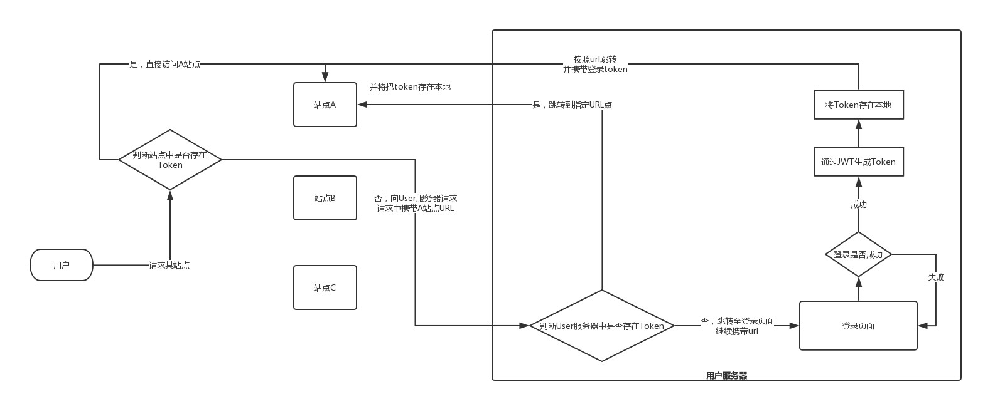

# CAS+JWT的单点登陆

单点登陆相关的东西也看见好久,终于真正意义上的实践了。

之前有尝试过：
* [基于共享Session的Laravel单点登陆](./基于共享Session的单点登陆.md)  
* [Laravel+JWT的用户系统](./Laravel+JWT的用户系统.md)

都没有采纳的原因：

​	项目部署的问题没有`域名`只有`IP`和`端口`，在不考虑修改`本地host`和`DNS服务器`前提下`共享Session`无法设置`SESSION_DOMAIN`这个参数，导致Session无法共享；JWT也是类似情况，获取到`Token`后没有地方村存，`Cookie`和`localStorage`在非同站点下无法跨域。

​	随后就发现了`CAS`这个好东西，发现还是比较符合需求的而且很多应用也在使用。

## 什么是CAS

`CAS`全称为`Central Authentication Service`即中央认证服务；

> CAS分为 Server和 Client两部分。
>
> Server负责用户的认证工作，就像是把第一次登录用户的一个标识存在这里，以便此用户在其他系统登录时验证其需不需要再次登录。
>
> CAS Client就是我们自己开发的应用程序，需要接入Server端。当用户访问我们的应用时，首先需要重定向到Server端进行验证，要是原来登陆过，就免去登录，重定向到下游系统，否则进行用户名密码登陆操作。

简单的学习后发现CAS好像是一种开发思想，不是写定好的某些代码。

所以我就根据我的理解加上`JWT`做了一个流程图。

​	之前单纯使用`JWT`遇到问题时没有地方存`Cookie`，因为我想做一个大的`Cookie`池所有应用都可以到里面去取`Token`，但是现实中浏览器为了安全不允许有这么一个池子。

​	配合上`CAS`后流程就变了，获取到`Token`后先存在了`User-Server`，然后在跳转或者请求过程中将`Token`传递给其他服务器并保存在相应的`Cookie`中。当我们读取`Token`时首先在本地，没有就去`User-Server`获取，再没有就只能取登录生成新的`Cookie`。

举个例子：

​	这个过程就像上学时候写作业，遇到不会的题了就去问爸爸，爸爸不会了就留着问老师，这就是`Token`的层层获取。

​	老师教会了我这道题，晚上我又把这道题教给爸爸，这就是`Token`的层层分发。

