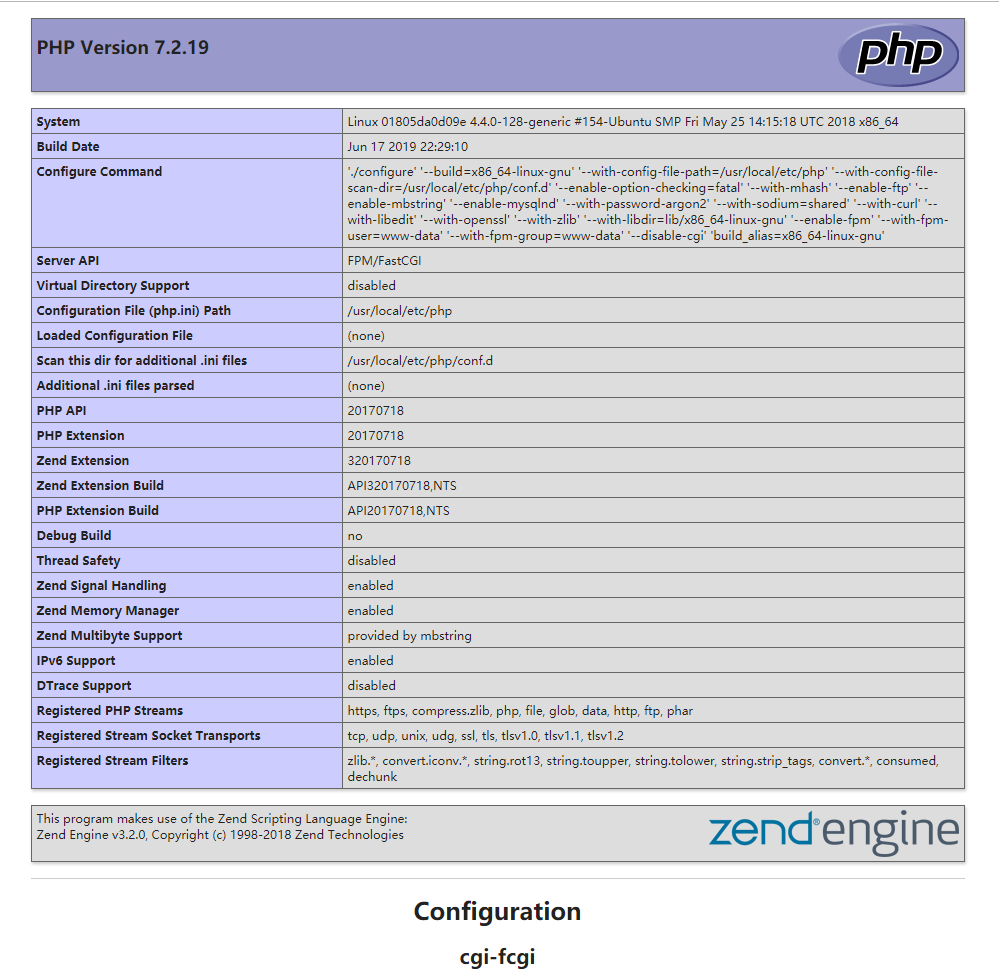

## 前言

这次可以说是手动搭建了,不使用集成工具。效果就行一台Linux下跑多个项目,但是他们使用的是同一个php环境;

先说下需要的食材：一台**Ubuntu16.4**并安装了Docker。


## 开始

Docker的核心是容器，一个完整的PHP环境至少包括以下几个容器：

* PHP
* MySQL
* Nginx、Apache

所以先从创建容器开始，我们提供**Docker命令**和**Docker-Compose**两个方法。


###  Docker命令

之前笔记写过了就不多讲了，简单说下

```shell
$ sudo docker pull [镜像名称]   拉取镜像
$ sudo docker images 	查看下载的镜像
$ sudo docker run [容器名] [镜像]... 生成容器

# 说两个之前没有用到的参数
--privileged=true 高级权利,挂载目录后容器可以访问目录以下的文件或者目录
--link使两个容器链接到一起，之间可以进行通讯，解除了对IP的依赖
```


但是已经被Docker命令折磨的不行了，所以这次没有通过命令生成容器。


### Docker-Compose

> Docker Compose是一个用来定义和运行复杂Docker应用的工具。一个使用Docker容器的应用，通常由多个容器组成。使用后就不无需要使用shell脚本来启动容器。 

#### 安装


```shell
$ curl -L https://github.com/docker/compose/releases/download/1.8.1/docker-compose-`uname -s`-`uname -m` > /usr/local/bin/docker-compose

$ chmod +x /usr/local/bin/docker-compose

$ docker-compose --version  # 查看版本
```


#### 部署文件

创建一个**compose.dockerfiles**文件，内容为下：

```PHP
version: "2"
services:
  mydb:
    build: ./mysql
    container_name: "mydb"
    restart: always
    ports:
      - "3306:3306"
    volumes:
      - /server/mysql:/var/lib/mysql
    environment:
      MYSQL_ROOT_PASSWORD: 123456
  myredis:
    build: ./redis
    container_name: "myredis"
    restart: always
    ports:
      - "6379:6379"
    volumes:
      - /server/redis:/data
  myphp:
    build: ./php
    container_name: "myphp"
    restart: always
    ports:
      - "9000:9000"
    volumes:
      - /server/www:/var/www/html
      - /server/php/php.ini:/usr/local/etc/php/php.ini
    links:
      - "mydb"
      - "myredis"
  mynginx:
    build: ./nginx
    container_name: "mynginx"
    restart: always
    ports:
      - "80:80"
    links:
      - "myphp"
    volumes:
      - /server/www:/usr/share/nginx/html
      - /server/nginx:/etc/nginx
      - /server/logs/nginx.logs:/var/log/nginx
```


不难看出，其实就是将原本的**docker run**语句格式化了一下，更易读了。

#### 运行

```shell
$ docker-compose up -d
```


#### 运行结果

然后查看所有docker容器

```shell
$ sudo docker ps -a
```


（Nginx按道理是有问题无法运行的，此处截图是我解决后看到的）


#### 文件映射问题

```shell
 Error response from daemon: oci runtime error: container_linux.go:247: starting container process caused "process_linux.go:364: container init caused \"rootfs_linux.go:54: mounting \\\"/var/lib/docker/overlay2/conf/nginx.conf\\\" to rootfs \\\"/var/lib/docker/overlay2/e7f9d2c6c6b5ea9b3d494e2a4031218acd5c0ccce5225faab2b851d657eedfd6/merged\\\" at \\\"/var/lib/docker/overlay2/e7f9d2c6c6b5ea9b3d494e2a4031218acd5c0ccce5225faab2b851d657eedfd6/merged/etc/nginx/nginx.conf\\\" caused \\\"not a directory\\\"\""
: Are you trying to mount a directory onto a file (or vice-versa)? Check if the specified host path exists and is the expected type.

# 问题已解决无完整报错，以上取自互联网
```


读到最后有一句：尝试将一个目录挂载到文件中？

所以问题处在挂载。

因为挂在后宿主的文件会替代容易内的文件，所以干脆把所有需要的配置文件复制到宿主机内。

```SHELL
# 因为无法运行，先删除原有容器
$ docker rm mynginx
mynginx   # 返回容器名表示操作成功

# 创建一个普通的nginx容器，无需端口和文件映射
$ docker run --name mynginx -d nginx
# 通过命令进入交互终端
$ docker exec -it mynginx /bin/bash
# 进入终端后去寻找nginx的配置文件
$ cd /etc/nginx/ 
# 想要的都在这了
$ ls
conf.d    fastcgi_params    koi-utf  koi-win  mime.types  modules  nginx.conf  scgi_params    uwsgi_params  win-utf
# 退出容器到宿主机里
exit
# 拷贝刚才看到的nginx文件夹
$ docker cp mynginx:/etc/nginx/ server/nginx/
# 重新执行（若已存在不会重复创建）
$ docker-compose up -d
```


#### 无法解析PHP代码问题


```shell
# 在server文件夹中映射了一个www目录就是用来放置代码的
# 创建一个index.html文件 并写入html标签 保存
# 因为已经映射80端口，直接外部浏览器访问宿主机ip就可以看到我们所要的东西了
# 但是创建一个php文件然后访问，却把php文件直接下载下来了
# 建议可以去nginx的Log文件看一下
$ cat /server/logs/nginx.logs/error.log
# 查看到很多类似报错
2019/06/18 12:32:01 [error] 6#6: *1 FastCGI sent in stderr: "Primary script unknown" while reading response header from upstream, client: 192.168.10.40, server: localhost, request: "GET / HTTP/1.1", upstream: "fastcgi://172.18.0.4:9000", host: "192.168.10.105"

# 既然有报错信息代表php和Nginx有通讯，但是没有解析成功
# 查看nginx的配置文件
$ cat /server/nginx/conf.d/default.conf
# 其中有一段
# pass the PHP scripts to FastCGI server listening on 127.0.0.1:9000
#location ~ \.php$ {
#    root           html;
#    fastcgi_pass   127.0.0.1:9000;
#    fastcgi_index  index.php;
#    fastcgi_param  SCRIPT_FILENAME  /scripts$fastcgi_script_name;
#    include        fastcgi_params;
#}
# 关于PHP文件的被注释掉了，导致nginx当遇到.php文件时无法通知php-fpm解析
# 但事实是取消注释重启后依旧无法解析
# 一顿搜索后。。。

# 关于fastcgi_pass参数需要填写php-fpm所在的ip及端口，端口9000已经实锤但是IP有三种
# 127.0.0.1:9000 ；容器的IP:9000（例如 172.18.0.4:9000） ； 填写PHP对应的容器名（例如  myphp:9000）
# 我填写的第三种 myphp:9000

# fastcgi_param  SCRIPT_FILENAME 同样要根据情况修改一下
# fastcgi_param  SCRIPT_FILENAME /var/www/html$fastcgi_script_name;
```

#### 测试

创建**index.php**文件并写入**phpinfo();**

可以看到：



