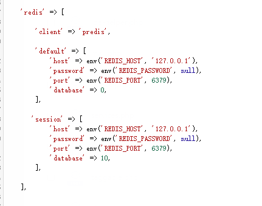
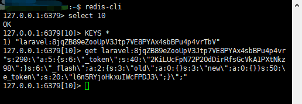

# Laravel中将Session改为Redis驱动

## Redis

不多介绍一个高性能NoSQL

### 安装

```shell
$ sudo apt-get install redis-server
# 安装成功后执行
$ redis-cli
# 如果命令行变为以下 代表安装成功
127.0.0.1:6379> 
```


```
# composer中安装predis
composer require predis/predis
```


## 开始修改

1. 修改``config/database.php``文件

   ```php
   # 在Redis中添加
   
    'session' => [
        'host' => env('REDIS_HOST', '127.0.0.1'),
        'password' => env('REDIS_PASSWORD', null),
        'port' => env('REDIS_PORT', 6379),
        'database' => 10,   
    ],
   
   # host,password,port 直接填写就好
   
   /**
   *	特意说一下database: 
   *	Redis将数据分为了12个库,或者理解成MySQL中的12个表?
   *	命令行中 通过 select 库id 进行查询
   */
   ```

   最终效果：

   


2. 修改``config/session.php``文件

````php
# 将驱动引擎由file改为redis
# connection配置项填入第一步中配置的redis连接名session
'driver' => env('SESSION_DRIVER','redis'),
'connection' => 'session',

````


3. 最后修改``.env``文件

````
SESSION_DRIVER=redis
````


## 测试一下

测试的项目是一个Laravel项目的登陆部分

````shell
# 首先通过ssh进入Redis命令行模式
$ redis-cli
# 首先切入至10号数据库
127.0.0.1:6379> select 10
OK
# 获取Redis中所有数据的KEY
127.0.0.1:6379[10]> KEYS *
1) "laravel:8jqZB89eZooUpV3Jtp7VE8PYAx4sbBPu4p4vrTbV"
# 通过key获取value
127.0.0.1:6379[10]> get laravel:8jqZB89eZooUpV3Jtp7VE8PYAx4sbBPu4p4vrTbV
"s:290:\"a:5{s:6:\"_token\";s:40:\"2KiLUcFpN72P2OdDirRfsGcVkA1PXtNkzIyuKTLk\";s:9:\"_previous\";a:1:{s:3:\"url\";s:21:\"http://192.168.10.198\";}s:6:\"_flash\";a:2:{s:3:\"old\";a:0:{}s:3:\"new\";a:0{}}s:50:\"login_web_59ba36addc2b2f9401580f014c7f58ea4e30989d\";i:11;s:12:\"single_token\";s:20:\"l6n5RYjoHkxuIWcFPDJ3\";}\";"
````


效果展示：

