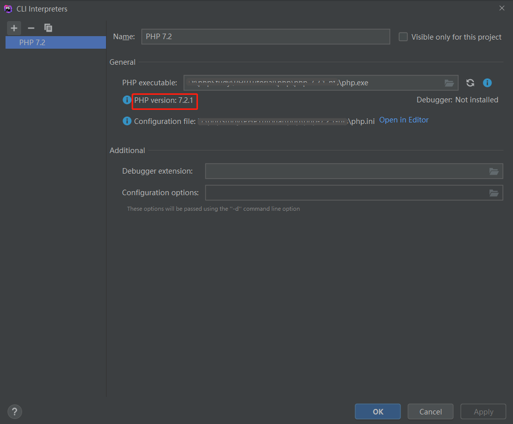
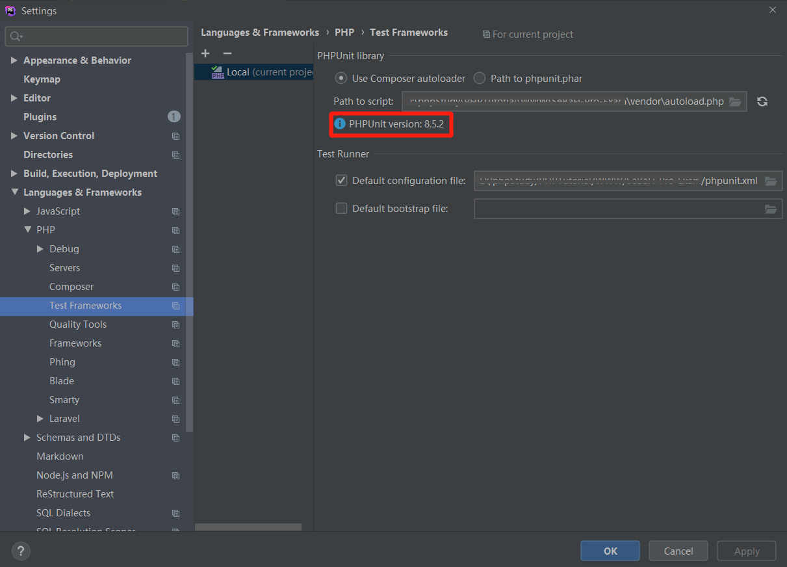
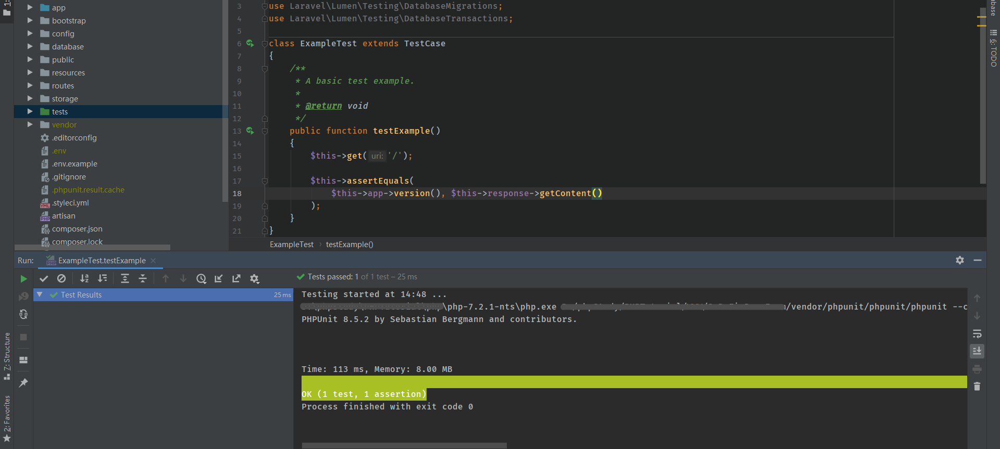
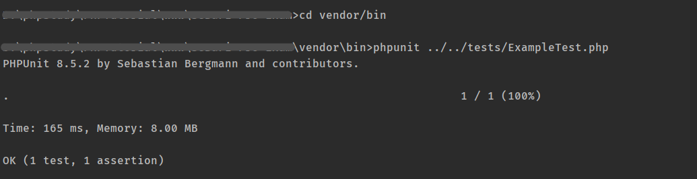
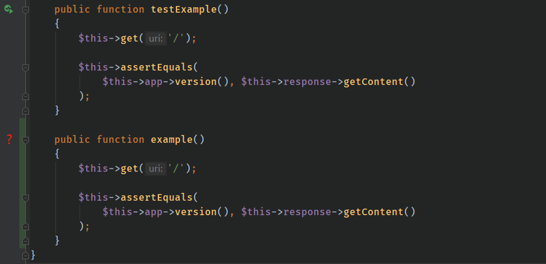
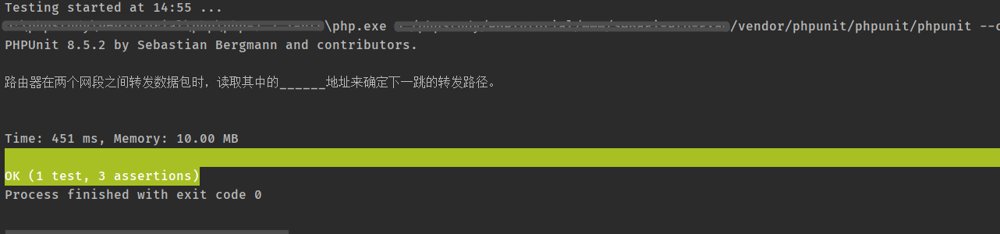

# **环境配置**

## **1.** **使用PhpStrom**

①配置php环境

File -> Setting -> Languages&Framework -> PHP 选择PHP版本 (建议和WEB环境版本统一)

如果CLI Interpreter没有可以选择的PHP版本 就点击右边的三个点



②配置PHPUnit环境

File -> Setting -> Languages&Framework -> Test Framework 选择PHPUnit 路径

 

注意填写路径为项目下的vendor\autoload.php，配置成功则显示PHPUnit版本号

 

 

## **2.** **使用命令行**



 

- 先进入项目下**vendor\bin** 目录
- 执行`phpunit ../../tests/ExampleTest.php` ，后面为相对路径

 

# 测试用例

## **1.** **注意事项**

- 在项目根目录的/tests文件夹下创建测试用例，目录结构与控制器统一
- 同一个测试类中可有多个方法，方法名需test开头 否则没有run的按钮



## 


## 2.模拟请求

```php
// 如果你想要创建一个自定义的 HTTP 请求到应用程序上，并获取完整的Response对象，则可以使用 call 方法：
public function testApplication()
{
    $response = $this->call('GET', '/');

    $this->assertEquals(200, $response->status());
}


// 如果你创建的是 POST、PUT、或是 PATCH 请求，则可以在请求时传入一个数组作为输入数据。
$response = $this->call('POST', '/user', ['name' => 'Taylor']);
```


## **3.** **原生断言方法（assertion）**

最常用的可能就是上面所用的**assertEquals** **，**还有很多方法根据实际情况使用具体参考[**PHPUnit官方文档**](https://phpunit.de/manual/6.3/zh_cn/appendixes.assertions.html)

 

## **4.** **Lumen封装API 测试方法**

 

 ```php
<?php

class ExampleTest extends TestCase
{
    public function testBasicExample()
    {
        // seeJson 方法会将传入的数组转换成 JSON，并验证该该JSON片段是否存在于应用程序返回响应中的任何位置。
        $this->post('/user', ['name' => 'Sally'])
             ->seeJson([
                'created' => true,
             ]);
    }

    public function testBasicExample()
    {
        // 使用 seeJsonEquals 方法：想验证传入的数组是否与应用程序返回的 JSON 完全 匹配，则可以
        $this->post('/user', ['name' => 'Sally'])
             ->seeJsonEquals([
                'created' => true,
             ]);
    }
}
 ```

[**Lumen官方文档**](#testing-json-apis)

 

# Demo 

这是一个获取题目的API，路由为：**admin/question** 请求参数为：**hashid=\**\****

```php
<?php
namespace Question;

use TestCase;

class IndexTest extends TestCase
{
    // 定义成功的状态码
    private $successCode = 200;

    public function testGetQuestionByHashid()
    {
        // 在数据库中随机获取一个hashid
        $hashid = \App\Question::inRandomOrder()->firstOrFail()->hashid;

        // 模拟请求
        $response = $this->call('get', '/admin/question',['hashid'=>$hashid]);

        // 首先判断是否请求成功
        $this->assertEquals($this->successCode,$response->status());

        // 获取题干
        $stem = \App\Question::where('hashid',$hashid)->firstOrFail('stem')->stem;

        // 判断是否得到需要的数据
        $this->seeJson([
            'hashid'=> $hashid,
            'stem'  => $stem
        ]);

        // 输出题干
        echo $stem;

    }
}
```


## **运行结果：**

