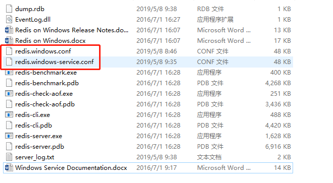
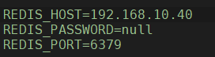
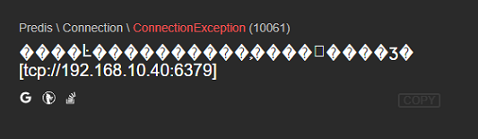
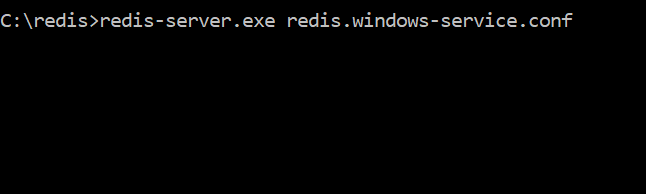
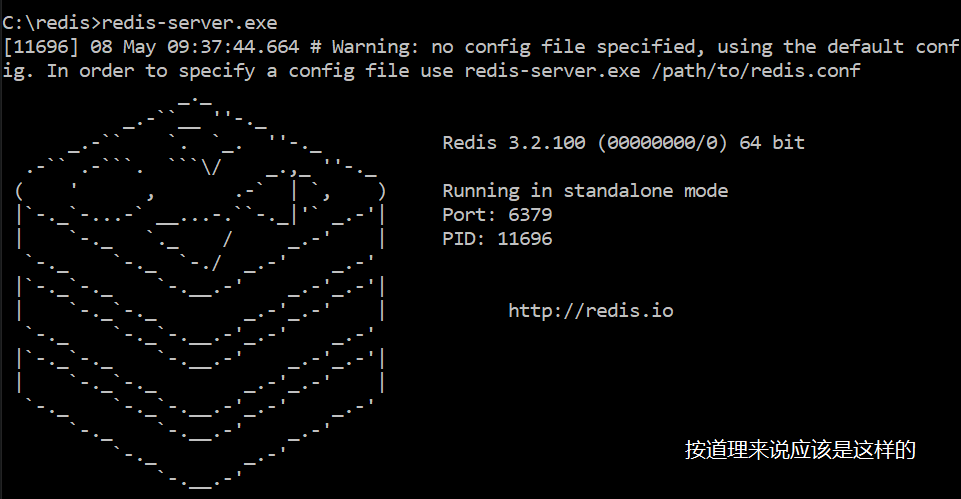

# Redis在Laravel中拒绝远程访问

之前将Laravel的项目修改了Session的驱动,并添加了一些数据的缓存。因为计划生产环境是一台独立的Redis服务器或容器,所以在配置中设置了远程访问,但是今天在与同事协同时才发现之前修改的配置文件没有生效。

> 首先介绍下我的开发环境：
>
> Win10 + PHP7.1  + Nginx
>
> Redis3.2的解压版

## 安装

[Redis - Git下载地址](https://github.com/MicrosoftArchive/redis/releases)

win环境下直接下载``ZIP``的包,并解压在本地就可以了。

为了方便启动可以去环境变量中设置PATH

## 修改配置文件

解压后会获得一下文件，当然很多我是不知道干什么用的，但是根据文件名大致也可以才出来。

>redis-server.exe  是服务端，CMD运行
>
>redis-cli  是客户端，CMD运行

下图两个红框文件就是要修改的配置文件。



在网上搜集资料后发现普遍存在修改了配置文件但是不生效的问题，绝大多数原因都是因为修改了``redis.windows.conf``文件，正确的是要修改``redis.windows-service.conf``。

我干脆把两个文件都改了，然后去``Laravel``中修改``.ENV``文件。



重启Redis服务。


运行结果：



有时候还会出现：

> ​	`SELECT` failed: DENIED Redis is running in protected mode because protected mode is enabled, no bind address was specified, no authentication password is requested to clients. In this mode connections are only accepted from the loopback interface. If you want to connect from external computers to Redis you may adopt one of the following solutions: 1) Just disable protected mode sending the command 'CONFIG SET protected-mode no' from the loopback interface by connecting to Redis from the same host the server is running, however MAKE SURE Redis is not publicly accessible from internet if you do so. Use CONFIG REWRITE to make this change permanent. 2) Alternatively you can just disable the protected mode by editing the Redis configuration file, and setting the protected mode option to 'no', and then restarting the server. 3) If you started the server manually just for testing, restart it with the '--protected-mode no' option. 4) Setup a bind address or an authentication password. NOTE: You only need to do one of the above things in order for the server to start accepting connections from the outside.
>
> 大致翻译后是要我修改配置文件：去掉bind 127.0.0.1 ；将 ``protected-mode``设置为关闭 。。。


很明显是错误的。

因为系统中集成了``Workerman``出现TCP我以为是两者不兼容，或者端口的问题。

研究后发现并不是他的问题，报错信息中的TCP是因为redis的客户端使用了它。

> Redis 通过监听一个 TCP 端口或者 Unix socket 的方式来接收来自客户端的连接，


随后我直接删除了两个conf文件内所有内容，重启后以然可以正常访问。

所以考虑到可能服务端并没有从这两个文件下取配置信息。

一顿搜索后发现了这条语句

```
C:\redis>redis-server.exe redis.windows-service.conf
```

前面是Redis的服务文件，后面是配置文件名称。


执行：



什么也没有返回，但是好像确实在运行，又但是和正常的启动不太一样




但是访问系统后没有报错，一切正常了。。。

