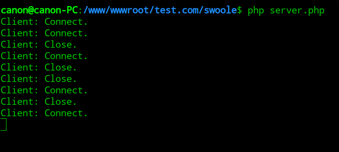
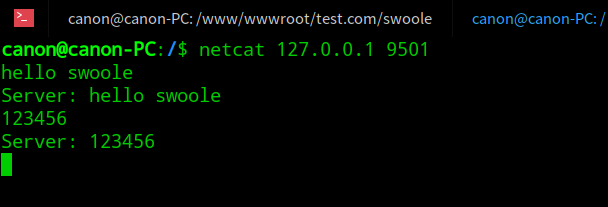
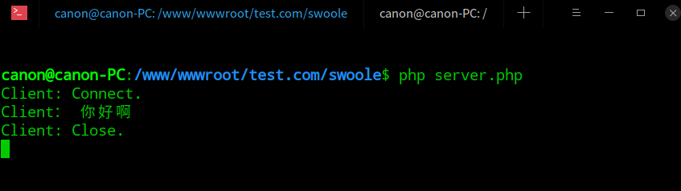

#	Swoole

* [Swoole官网](https://www.swoole.com/)
* [GitHub](https://github.com/swoole/swoole-src)
* [官方文档](https://wiki.swoole.com/)

## ~~Win环境下的Swoole安装~~

> Win环境下不支持，需要下载[cgywin](https://www.cnblogs.com/itsuibi/p/8995137.html)，太麻烦了溜了溜了直接上Linux

## 	开始

- Deepin 15.9 Desktop
- PHP 7.1
- Nginx

### 起步第一个坑

  > Fatal error: swoole_server::__construct(): swoole_server only can be used in PHP CLI mode. in /www/..../index.php on line 3

  必须通过PHP CLI ，WEB环境是不行的

  ```shell
  php /www/..../index.php
  ```

> 成功执行Swoole服务器程序后，如果你的代码中没有任何echo语句，屏幕不会有任何输出，但实际上底层已经在监听网络端口，等待客户端发起连接。可使用相应的客户端工具和程序连接到服务器，进行测试。

## TCP协议（swoole_server）

### 创建TCP服务端

* server.php

```php
//创建Server对象，监听 127.0.0.1:9501端口
$serv = new swoole_server("127.0.0.1", 9501); 

//监听连接进入事件
$serv->on('connect', function ($serv, $fd) {  
    echo "Client: Connect.\n";
});

//监听数据接收事件
$serv->on('receive', function ($serv, $fd, $from_id, $data) {
    $serv->send($fd, "Server: ".$data);
});

//监听连接关闭事件
$serv->on('close', function ($serv, $fd) {
    echo "Client: Close.\n";
});

//启动服务器
$serv->start(); 

```

* 运行程序

  ```shell
  php server.php	
  ```

* **运行结果：**

  * 使用浏览器访问 127.0.0.1:9501时终端会提示Connect、Close

    

  * 通过netcat工具链接后并发送文字效果：


* **总结：**

  * 创建一个TCP服务器，用于监听9501端口。
  * swoole_server是异步服务器，是通过监听事件的方式来编写程序的。
  * 当对应的事件发生时底层会主动回调指定的PHP函数。如当有新的TCP连接进入时会执行onConnect事件回调，当某个连接向服务器发送数据时会回调onReceive函数，链接退出时会执行onClose函数。
  * 此时会有很多的服务器链接，$fd就是客户端连接的唯一标识符
  * 调用 `$server->send()` 方法向客户端连接发送数据，参数就是$fd客户端标识符
  * 调用 `$server->close()` 方法可以强制关闭某个客户端连接。

     


### 创建TCP客户端

对服务端做了小调整

```php
//监听数据接收事件
$serv->on('receive', function ($serv, $fd, $from_id, $data) {
    echo "User： $data \n";
    $serv->send($fd, "Server: ".$data);
});
//监听数据接收事件
$serv->on('receive', function ($serv, $fd, $from_id, $data) {
    echo "Client： $data \n";  #【新增】向服务端发送数据时会展示出来
    $serv->send($fd, "Server: ".$data);
});
```

   

client.php

```php
<?php
$client = new swoole_client(SWOOLE_SOCK_TCP);
//连接到服务器
if (!$client->connect('127.0.0.1', 9501, 0.5))
{
    die("connect failed.");
}
//向服务器发送数据
//此处与官网demo不同，稍作了修改，可以通过url动态的发送数据
if (!$client->send($_GET['a'])) 
{
    die("send failed.");
}
//从服务器接收数据
$data = $client->recv();
if (!$data)
{
    die("recv failed.");
}
echo $data;
//关闭连接
$client->close();
```

* **运行程序：**

  * 因为有了客户端就不需要netcat做模拟请求了，直接可以在浏览器中打开`http://127.0.0.1:7777/swoole/client.php?a=你好啊`

* **运行结果：**

  * 如图

    