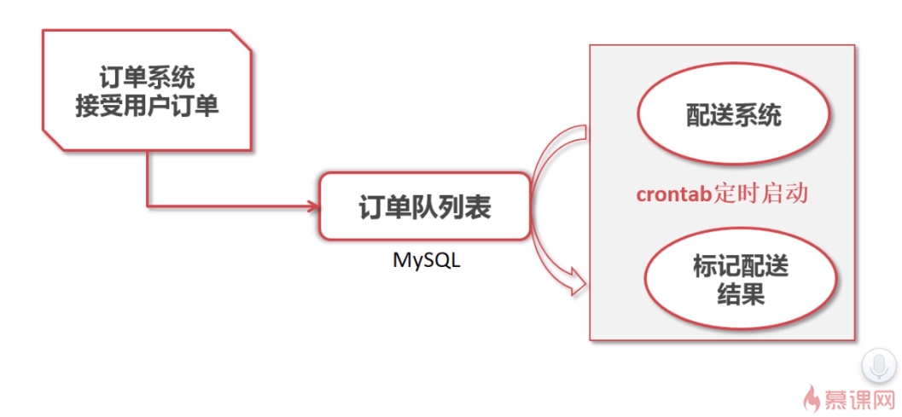
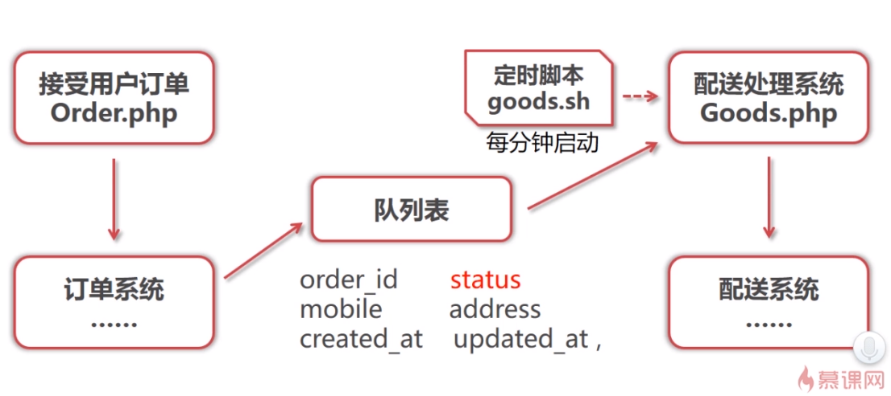
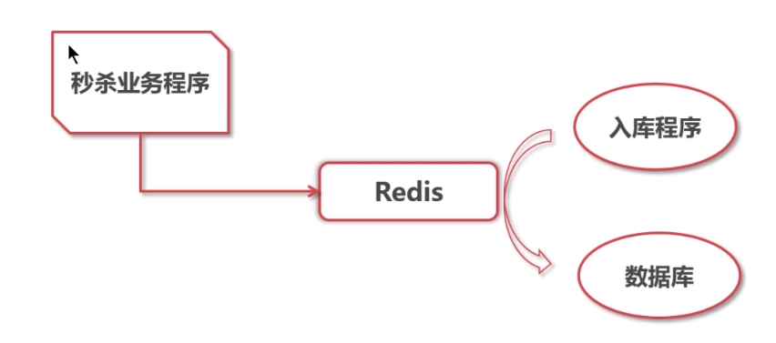
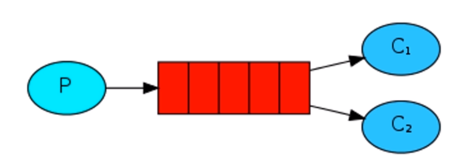

目前对消息队列并不了解其原理，本篇文章主要是通过慕课网学习归纳的一些笔记，为后续学习打下基础。

众所周知在对网站设计的时候，会遇到给用户“群发短信”，“订单系统有大量的日志”，“秒杀设计”等，服务器没法处理这种瞬间迸发的压力，这种情况要保证系统正常有效的使用，就需要“消息队列”的帮助。本篇主要通过消息队列的思路进行学习。

主要了解如下知识：

　　1、队列是个什么东西，他能干什么？

　　2、对列的应用场景有哪些？

　　3、如何使用队列对业务进行解偶？

　　4、如何使用Redis队列来消除高压力？

　　5、专业的对列系统[RabbitMQ](https://baike.baidu.com/item/rabbitmq/9372144?fr=aladdin)如何使用？

归纳如下主要内容

　　@消息队列的概念，原理和场景

　　@解耦案例：队列处理订单系统和配送系统

　　@流量削峰案例：Redis的List类型实现秒杀

　　@RabbitMQ：更专业的消息系统实现方案

**一、认识消息队列**

1.1 消息对列概念

　　从本质上说消息对列就是一个队列结构的中间件，也就是说消息放入这个中间件之后就可以直接返回，并不需要系统立即处理，而另外会有一个程序读取这些数据，并按顺序进行逐次处理。

　　也就是说当你遇到一个并发特别大并且耗时特别长同时还不需要立即返回处理结果，使用消息队列可以解决这类问题。

1.2 核心结构

由一个业务系统进行入队，把消息逐次插入到消息队列中，插入成功之后直接返回成功的结果，后续会有一个消息处理系统，这个系统会把消息系统中的记录逐次进行取出并进行处理，完成一个出队的流程。

1.3 应用场景

　　数据冗余：比如订单系统，后续需要严格的进行数据转换和记录，消息队列可以把这些数据持久化的存储在队列中，然后有订单，后续处理程序进行获取，后续处理完之后在把这条记录进行删除来保证每一条记录都能够处理完成。

　　系统解耦：使用消息系统之后，入队系统和出队系统是分开的，也就说只要一天崩溃了，不会影响另外一台系统正常运转。

　　流量削峰：例如秒杀和抢购，我们可以配合缓存来使用消息队列，能够有效的顶住瞬间访问量，防止服务器承受不住导致崩溃。

　　异步通信：消息本身使用入队之后可以直接返回。

　　扩展性：例如订单队列，不仅可以处理订单，还可以给其他业务使用。

　　排序保证：有些场景需要按照产品的顺序进行处理比如单进单出从而保证数据按照一定的顺序处理，使用消息队列是可以的。

以上都是消息队列常见的使用场景，当然消息队列只是一个中间件，可以配合其他产品进行使用。

1.4 常见队列实现优缺点

　　队列介质

　　　　1、数据库，例如mysql（可靠性高，易实现，速度慢）

　　　　2、缓存， 例如redis （速度快，单个消息报包过大时效率低）

　　　　3、消息系统，例如rabbitMq （专业性强，可靠，学习成本高）

　　消息处理触发机制

　　　　1、死循环方式读取：易实现，故障时无法及时恢复；（比较适合做秒杀，比较集中，运维集中维护）

　　　　2、定时任务：压力均分，有处理上限；目前比较流行的处理触发机制。（唯一的缺点是间隔和数据需要注意，不要等上一个任务没有完成下一个任务又开始了）

　　　　3、守护进程：类似于php-fpm 和php-cg,需要shell基础

 

**二、解藕案例：队列处理“订单系统”和“配送系统”**

　　简单说一下程序解耦：程序解耦就是避免出现你老婆和你妈同时掉到水里先去救谁的问题（偷笑ing）

　　对于订单流程，我们可以设计两个系统，一个是“订单系统” 另外一个是 “配送系统”， 在网购的时候我们应该都见过，当我提交了一个订单之后，我在后台可以看到我的货物正在配送中。这个时候就要参与进来一个“配送系统”。

　　如果我们在做架构的时候把 “订单系统” 和 “配送系统” 设计在一起的话就会出现一些问题，首先对于订单系统来说，因为系统的压力会比较大，但是 "配送系统" 没必要为这些压力做一些即时的反应。

　　第二个我们也不希望在订单系统出现故障之后导致配送系统也出现故障，这个时候就会同时影响到两个系统的正常运转。所以我们希望把这两个系统进行解耦。这两系统分开之后我们可以通过一个中间的 “队列表” 进行这两个系统的沟通。

2.1 架构设计

 

　　1、首先订单系统会接收用户的订单，然后进行订单的处理。

　　2、然后会把这些订单信息写到队列表中，这个队列表是沟通这两个系统的关键。

　　3、由配送系统定时执行的一个程序来读取队列表进行处理。

　　4、配送系统处理之后，会把已处理的记录进行标记。

2.2 程序流程

**三、流量削峰案例：Redis 的 list 类型实现秒杀**

　　redis 基于内存，它的速度会非常快，redis 对数据库有一个非常好的补充作用因为它是可持久化的，redis会周期性的把数据写到硬盘里，所以它不用担心断电的问题，从这方面说它比另一款缓存 memcache 更有优势些，另外 redis 提供五种数据类型（字符串，双向链表，哈希，集合，有序集合）

　　一般情况下，做秒杀案例，抢购，瞬间高比你高发，需要排队 的案例中 redis是一个很好的选择。

3.1 redis数据类型中的 list 类型

　　redis 的list 是一个双向链表，可以从头部或者尾部追加数据。

　　* LPUSH/LPUSHX :将值插入到（/存在的）列表头部

　　* RPUSH/RPUSHX: 将值插入到（/存在的）列表尾部

　　* LPOP : 移除并获取列表的第一个元素

　　* RPOP: 移除并获取列表的最后一个元素

　　* LTRIM: 保留指定区间内的元素

　　* LLEN: 获取列表长度

　　* LSET: 通过索引设置列表元素的值

　　* LINDEX: 通过索引获取列表中的元素

　　* LRANGE: 获取列表指定范围内的元素

3.2 架构设计

　　一个简单结构秒杀的程序设计。

　　1、首先记录是哪一个用户参与了秒杀同时记录他的时间。

　　2、将用户的id存到redis列表中，让它排队。如果规定只有前10个用户可以参与成功，如果列表中的个数已经够了就不会让它继续追加数据。这样redis的列表长度就只会是10个

　　3、最后在慢慢的将redis中的数据写入到数据库中，以减少数据的压力

3.3 代码级设计

　　1、当用户开始秒杀时，将秒杀程序的请求写入Redis (uid, time_stamp)中。

　　2、假使规定只有10人可以秒杀成功，检查 Redis 已经存放数据的长度，超出上限直接丢弃说明秒杀完成。

　　3、最后在死循环处理存入Redis中的10条数据，然后在慢慢的取数据并存入到mysql数据库中。

在秒杀这一块对于数据库的压力特别的大，如果我们没有这样的设计，会造成mysql的写入瓶颈。我们通过Redis的一个对列list，然后把秒杀的请求放入到Redis里面， 最后通过入库程序，把数据慢慢的写入到数据库，这样的话就可以实现流量的均衡，对mysql不会造成太大的压力。　

**四、RabbitMQ**

　　这里讲解一些RabbitMQ的使用，首先我们之前讲秒杀案例的时候提到了锁的机制，防止其他程序处理同一条记录，如果我们的系统架构非常的复杂，有多个程序实时的读取一个队列，或者我有多个发送程序，同时来操作一个或多个队列，甚至我还想这些程序分布在不同的机器上，这种情况下用redis队列就有些力不从心了。这种时候怎么办呢，我们就需要来引入一些更专业的消息队列系统，这些系统可以更好的来解决问题。

4.1 RabbitMQ的架构和原理

　　

 

特点：完整的实现了AMQP,集群简化，持久化，跨平台

　　RabbitMQS使用

　　　　1、RabbitMQ安装 （rabbitmq-server, php-amqplib）

　　　　2、生产者向消息通道发送消息

　　　　3、消费者处理消息

　　工作队列

　　　　

　　　　思想：由生产者发送给消息系统，消息系统把任务封装成消息队列之后，然后供多个消费者使用同一个队列

　　　　这不仅解决了生产者和消费者之间的解耦，还可以实现了消费者和任务的共享，减缓了服务器的压力。

**五、总结**

　　以上主要学习消息队列的概念，原理，场景。解耦案例以及削峰案例，以及了解RabbitMQ的简单使用方法。

六、问题

　　redis 和消息服务器 选择的最大区别是什么。

　　　　我的理解是Redis 是一个一个处理请求，redis属于单线程，它和消息服务器 IO 的实现方式不同，一个是同步一个是异步，而redis使用的是同步阻塞，而消息服务器使用的是异步非阻塞。