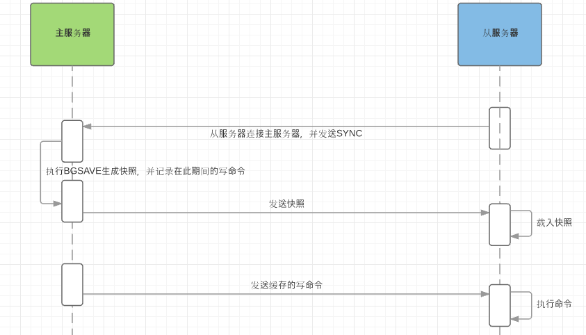
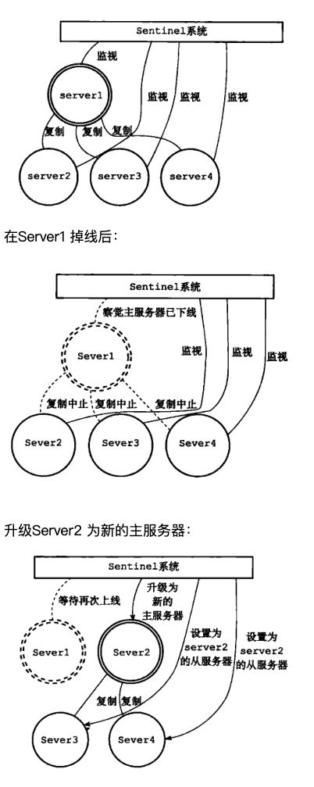

## 主从复制

### 简介

建立一个和**主机**（Master）完全一样的环境，称为**从机**（Slaves）并实现两者的同步与通信。

Master节点在平时提供服务，另外一个或多个Slave节点在平时不提供服务（或只提供数据读取服务）。当Master节点由于某些原因停止服务后，再人工/自动完成Slave节点到Master节点的切换工作，以便整个Redis集群继续向外提供服务。

### 作用

- 做数据的热备份
- 降低磁盘I/O访问的频率**，**提高单个机器的I/O性能。

### 原理

Redis全量复制一般发生在Slave初始化阶段，这时Slave需要将Master上的所有数据都复制一份。具体步骤如下： 

1. 从服务器连接主服务器，发送SYNC命令； 

2. 主服务器接收到SYNC命名后，开始执行BGSAVE命令生成RDB文件并使用缓冲区记录此后执行的所有写命令； 

3. 主服务器BGSAVE执行完后，向所有从服务器发送快照文件，并在发送期间继续记录被执行的写命令； 

4. 从服务器收到快照文件后丢弃所有旧数据，载入收到的快照； 

5. 主服务器快照发送完毕后开始向从服务器发送缓冲区中的写命令； 

6. 从服务器完成对快照的载入，开始接收命令请求，并执行来自主服务器缓冲区的写命令； 

### 同步

**Redis 2.8**版本以上使用psync命令完成同步，过程分“全量”与“部分”复制

- **全量复制**：一般用于初次复制场景（第一次建立SLAVE后全量）
- **增量同步**：Slave完成初始化工作后,Master发生写操作时同步到Slave的过程
- 心跳：主从有长连接心跳，主节点默认每10S向从节点发ping命令，repl-ping-slave-period控制发送频率

### 缺点

- 主从复制，若主节点出现问题，则不能提供服务，需要人工修改配置将从变主
- 主从复制主节点的写能力单机，能力有限
- 单机节点的存储能力也有限
- 扩容困难

### 总结

主从复制的方法实现Redis集群可以有效帮助系统提高数据完整性,但是功能有限很多场景下还是需要人工的存在。

## 哨兵模式

### 简介

哨兵（sentinel）进程是用于监控Redis集群中Master主服务器工作的状态。

像是多了个监工替运维人员时时刻刻监督着Redis保证其正常运行

### 作用

- **监控(Monitoring)**: 哨兵会不断地定期检查你的主服务器和从服务器是否运作正常。
- **提醒(Notification)**: 当被监控的某个 Redis 服务器出现问题时， 哨兵可以通过 API 向管理员或者其他应用程序发送通知。
- **自动故障迁移(Automaticfailover)**: 当一个主服务器不能正常工作时， Sentinel 会开始一次自动故障迁移操作， 它会将失效主服务器的其中 一个从服务器升级为新的主服务器， 并让失效主服务器的其他从服务器改为复制新的主服务器; 当客 户端试图连接失效的主服务器时， 集群也会向客户端返回新主服务器的地址， 使得集群可以使用新主 服务器代替失效服务器。

### 原理

1. 每个Sentinel以每秒钟一次的频率向它所知的Master，Slave以及其他 Sentinel 实例发送一个 PING 命令。

2. 如果一个实例（instance）距离最后一次有效回复 PING 命令的时间超过 down-after-milliseconds 选项所指定的值， 则这个实例会被 Sentinel 标记为主观下线。 

3. 如果一个Master被标记为主观下线，则正在监视这个Master的所有 Sentinel 要以每秒一次的频率确认Master的确进入了主观下线状态。 

4. 当有足够数量的 Sentinel（大于等于配置文件指定的值）在指定的时间范围内确认Master的确进入了主观下线状态， 则Master会被标记为客观下线 。

5. 在一般情况下， 每个 Sentinel 会以每 10 秒一次的频率向它已知的所有Master，Slave发送 INFO 命令 。

6. 当Master被 Sentinel 标记为客观下线时，Sentinel 向下线的 Master 的所有 Slave 发送 INFO 命令的频率会从 10 秒一次改为每秒一次 。

7. 若没有足够数量的 Sentinel 同意 Master 已经下线， Master 的客观下线状态就会被移除。 

8.  若 Master 重新向 Sentinel 的 PING 命令返回有效回复， Master 的主观下线状态就会被移除。

### 优势

#### 高可用

由一个或多个Sentinel 实例 组成的Sentinel 系统可以监视任意多个主服务器，以及这些主服务器属下的所有从服务器，并在被监视的主服务器进入下线状态时，自动将下线主服务器属下的某个从服务器升级为新的主服务器。

## Cluster

Redis Cluster是Redis的分布式解决方案，在Redis 3.0版本正式推出的也是Redis官方提供的Redis集群功能。

当遇到单机内存、并发、流量等瓶颈时，可以采用Cluster架构达到负载均衡的目的。分布式集群首要解决把整个数据集按照分区规则映射到多个节点的问题，即把数据集划分到多个节点上，每个节点负责整个数据的一个子集。Redis Cluster采用哈希分区规则中的虚拟槽分区。虚拟槽分区巧妙地使用了哈希空间，使用分散度良好的哈希函数把所有的数据映射到一个固定范围内的整数集合，整数定义为槽（slot）。Redis Cluster槽的范围是0 ～ 16383。槽是集群内数据管理和迁移的基本单位。采用大范围的槽的主要目的是为了方便数据的拆分和集群的扩展，每个节点负责一定数量的槽。Redis Cluster采用虚拟槽分区，所有的键根据哈希函数映射到0 ～ 16383，计算公式：slot = CRC16(key)&16383。每一个实节点负责维护一部分槽以及槽所映射的键值数据。下图展现一个五个节点构成的集群，每个节点平均大约负责3276个槽，以及通过计算公式映射到对应节点的对应槽的过程。

## 总结

| 方式     | 优势                 | 缺点                     |
| -------- | -------------------- | ------------------------ |
| 主从复制 | 备份、读写分离       | 不能自动故障恢复         |
| 哨兵     | 故障自动恢复、高可用 | 不能解决负载均衡的问题。 |
| cluster  | 解决了负载均衡的问题 |                          |

