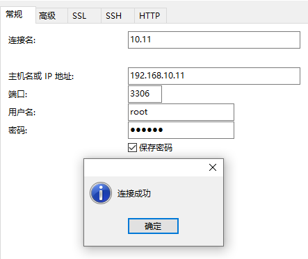

# Docker下Mysql及外部访问

系统拆分后为了方便将来对数据库折腾干脆趁机把数据库也拆出来单独布置。

环境：Ubuntu16.04 Server

## 安装Docker

参考之前的笔记 [Docker笔记](./其他/Docker笔记.md) 

## 安装镜像

* 首先是将MySQL的镜像拉下来

  ```
  docker pull mysql:5.6
  # 通过命令 docker images 就可以看到下载的镜像了
  ```


- 从镜像生成容器

  ```
  docker run -p 3306:3306 --name mysql -v $PWD/conf:/etc/mysql/conf.d -v $PWD/logs:/logs -v $PWD/data:/var/lib/mysql -e MYSQL_ROOT_PASSWORD=123456 -d mysql:5.6
  
  # docker ps -a 就可以查看容器的状态
  ```

  > **-p 3306:3306**：将容器的 3306 端口映射到主机的 3306 端口。
  >
  > **-v -v $PWD/conf:/etc/mysql/conf.d**：将主机当前目录下的 conf/my.cnf 挂载到容器的 /etc/mysql/my.cnf。
  >
  > **-v $PWD/logs:/logs**：将主机当前目录下的 logs 目录挂载到容器的 /logs。
  >
  > **-v $PWD/data:/var/lib/mysql** ：将主机当前目录下的data目录挂载到容器的 /var/lib/mysql 。
  >
  > **-e MYSQL_ROOT_PASSWORD=123456：**初始化 root 用户的密码。	


## 允许外部访问

首先进入MySQL的命令行模式

```php
docker exec -it mysql bash
# mysql 为 之前安装的容器名

mysql -u root -p
    
# -p就可以 先不用输入密码
# 出现一个 Enter password:   然后输入密码
# 密码正确后出现了熟悉的味道
    
mysql>
    
# 依次输入 , 主要意思就是添加一个root外网权限,初始只可以在localhost下  %代表ALL
# 最后一句尤为重要,刷新配置命令
mysql> grant all privileges on *.* to 'root'@'%' identified by 'password123';
mysql> update `mysql`.`user` set `Grant_priv` = 'Y' where `user` = 'root';
mysql> delete from user where user='root' and host='localhost';
mysql> flush privileges;

```


然后我通过`Navicat`测试




