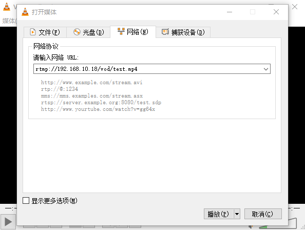

# RTMP流媒体框架

Q：为什么又写了一个RTMP的笔记

A：因为上一篇确实有问题中间少了些东西，而且本次在Docker下搭建出现了一些小坑


## 环境

* KVM下的Docker
* Ubuntu1604


## 开始


### 第一步：安装Docker及Ubuntu镜像

```shell
跳过... 

# 但是要记得映射端口 ，需要web+rtmp就映射两个
```


### 第二步：安装相关依赖

```shell
# 之前都是这么安装
$ apt-get install build-essential libpcre3 libpcre3-dev openssl libssl-dev

# 但是呢,事实证明Docker的纯净镜像缺很多东西
# 可以通过该命令下载某软件的所有依赖包但是就不安装该软件
$ apt-get build-dep nginx

# 但是呢,会出错,提示我没有下载的源
$ cd /etc/apt/sources.list

$ vim /etc/apt/sources.list

# 删除＃或添加行deb-src $ url。

# 例：
deb http://ch.archive.ubuntu.com/ubuntu/ saucy main restricted
deb-src http://ch.archive.ubuntu.com/ubuntu/ saucy main restricted
...

```


### 第三步 ：安装Nginx及RTMP插件

```shell
# 创建一个目录安置Nginx
$ mkdir /rtmp
$ cd /rtmp

# 下载 nginx 和 nginx-rtmp的源码(注意版本)
$ wget http://nginx.org/download/nginx-1.10.3.tar.gz 
$ wget https://github.com/arut/nginx-rtmp-module/archive/master.zip

# 安装unzip，解压下载的安装包(已安装可忽略)
$ sudo apt-get install unzip

# 解压 nginx 和 nginx-rtmp安装包 并切换到 nginx目录
$ tar -zxvf nginx-1.10.3.tar.gz
$ unzip master.zip 
$ cd nginx-1.10.3

# 配置
./configure --prefix=/rtmp/nginx --add-module=../nginx-rtmp-module --with-http_ssl_module
# 上面有兩个路径--prefix、--add-module  要注意

# 编译安装
$ make sudo make install

# 安装成功,运行
$ cd /usr/local/nginx 
# ./sbin/nginx -V 可以查看具体信息
# ./sbin/nginx -s 开启关闭,重启等
# ./sbin/nginx -h 帮助
$ ./sbin/nginx 
```


### 第四步：访问Nginx


* 访问192.168.1.231

  

  

  


### 第五步：配置Nginx


```shell

# 根据刚才的目录去寻找
cd /rtmp/nginx/conf/nginx.conf


# user  nobody;
worker_processes  1;


events {
    worker_connections  1024;
}

# my start 点播视频 服务器的配置
# 播放地址示例: rtmp://localhost/vod/qq.mp4 注意不支持中文视频名称
rtmp {                
    server {
        listen 80;  # 服务端口;因为我Docker只映射了一个80又不需要web就用上了
        chunk_size 4096;   # 数据传输块的大小

        application vod {  # vod为应用名 可自定义
            play /videos; # 视频文件存放目录。
        }
    }
}

...

# 配置完记得重启
cd /usr/local/nginx 
./sbin/nginx -s reload
```


### 第六步：查看效果




