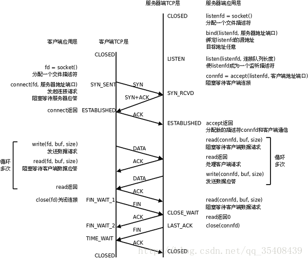
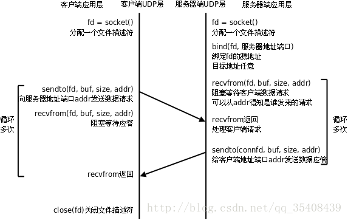

# TCP、UDP区别

最近在学习``SWOOLE``时涉及到了TCP、UDP和HTTP，一下子解释不通个所以然只能回头重新看看大学知识。

## TCP 

TCP是一种面向**有连接**的传输协议。保证了两端通讯的可达。

每条TCP连接只能用于两个断点，一对一 。

TCP提供可靠交付的服务：连接传输数据、无差错、不丢失、不重复、并且按序到达 。

可以有效利用宽带，缓解网络拥堵。

但是建立和断开连接徐连三次的对话，七次的收包发包，导致了流量的浪费。

​	

* **虚拟过程：**
  * 主机A向主机B发出连接请求数据包：“我想给你发数据，可以吗？”，这是第一次对话；
  * 主机B向主机A发送同意连接和要求同步（同步就是两台主机一个在发送，一个在接收，协调工作）的数据包：“可以，你什么时候发？”，这是第二次对话；
  * 主机A再发出一个数据包确认主机B的要求同步：“我现在就发，你接着吧！”，这是第三次对话。
  * 三次“对话”的目的是使数据包的发送和接收同步，经过三次“对话”之后，主机A才向主机B正式发送数据。 

## UDP

无链接。 

UDP没有拥塞控制。

UDP支持一对一、一对多、多对一和多对多的交互通信。 

UDP的首部开销小，只有8字节

## 区别

​	如果对实时性要求高和高速传输的场合下需要使用udp；

​	如果需要传输大量数据且对可靠性要求高的情况下应该使用tcp；

​	在可靠性要求较低，追求效率的情况下应该使用udp。

|   特点   |       TCP        |               UDP                |
| :------: | :--------------: | :------------------------------: |
|  连接性  | 面向连接，一对一 | 面向非连接一对一，一对多，多对一 |
|  可靠性  |       可靠       |              不可靠              |
| 传输效率 |        低        |                高                |
|  稳定性  |       稳定       |          不稳定，易丢包          |

* TCP(需要三次握手确定通信成功后进行建立连接)
  * 互联网和企业网上的客户端应用、数据传输的性能必须让位于数据传输的完整性、可控制性和可靠性时，TCP协议是当然的选择。
* DUP(直接发送，不会判断是否接收和发送成功)
  *  当强调传输性能而不是传输的完整性时，所以音频和多媒体应用UDP是最好的选择。例如QQ、微信发送消息对方不在线也可以收到；

​		

## HTTP

最后插一嘴HTTP，虽然HTTP也是一个协议但归根到底还是基于TCP的一个协议。

所以决定http 还是单独写一章吧

## 参考

《图解TCP/IP》 · 竹下隆史 [人民邮电出版社] 

[Socket通信——TCP、UDP区别总结、使用场景](https://blog.csdn.net/qq_35408439/article/details/73250532)

[tcp和udp的应用场景](http://m.elecfans.com/article/597878.html)