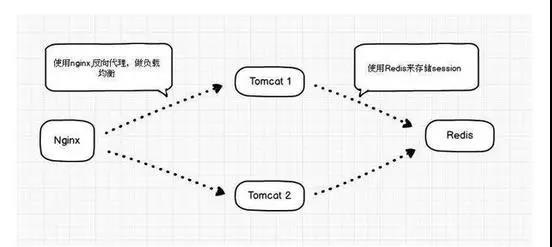

## 开始

#### 1. 基于FS的Session共享

NFS是Net FileSystem的简称，最早由Sun公司为解决Unix网络主机间的目录共享而研发。

这个方案实现最为简单，无需做过多的二次开发，仅需将共享目录服务器mount到各频道服务器的本地session目录即可，缺点是NFS依托 于复 杂的安全机制和文件系统，因此并发效率不高，尤其对于session这类高并发读写的小文件， 会由于共享目录服务器的io-wait过高，最终拖累前端WEB应用程序的执行效率。

#### 2. 基于数据库的Session共享

首选当然是大名鼎鼎的Mysql数据库，并且建议使用内存表Heap，提高session操作的读写效率。这个方案的实用性比较强，相信大家普 遍在 使用，它的缺点在于session的并发读写能力取决于Mysql数据库的性能，同时需要自己实现session淘汰逻辑，以便定时从数据表中更新、删除 session记录，当并发过高时容易出现表锁，虽然我们可以选择行级锁的表引擎，但不得不否认使用数据库存储Session还是有些杀鸡用牛刀的架势。

#### 3. 基于Cookie的Session共享

这个方案我们可能比较陌生，但它在大型网站中还是比较普遍被使用。原理是将全站用户的Session信息加密、序列化后以Cookie的方式， 统一 种植在根域名下(如：.host.com)，利用浏览器访问该根域名下的所有二级域名站点时，会传递与之域名对应的所有Cookie内容的特性，从而实现 用户的Cookie化Session 在多服务间的共享访问。

这个方案的优点无需额外的服务器资源;缺点是由于受http协议头信心长度的限制，仅能够存储小部分的用户信息，同时Cookie化的 Session内容需要进行安全加解密(如：采用DES、RSA等进行明文加解密;再由MD5、SHA-1等算法进行防伪认证)，另外它也会占用一定的带 宽资源，因为浏览器会在请求当前域名下任何资源时将本地Cookie附加在http头中传递到服务器。

#### 4. 基于Memcache的Session共享

Memcache由于是一款基于Libevent多路异步I/O技术的内存共享系统，简单的Key + Value数据存储模式使得代码逻辑小巧高效，因此在并发处理能力上占据了绝对优势，目前本人所经历的项目达到2000/秒 平均查询，并且服务器CPU消耗依然不到10%。

另外值得一提的是Memcache的内存hash表所特有的Expires数据过期淘汰机制，正好和Session的过期机制不谋而合，降低了 过期Session数据删除的代码复杂度，对比“基于数据库的存储方案”，仅这块逻辑就给数据表产生巨大的查询压力。

#### 5、基于Redis 的Session共享

## 声明

转自[[PHP技术大全]微信公众号](https://mp.weixin.qq.com/s/b4WQ2tnHlZ9nBaaU-Uzo4Q)