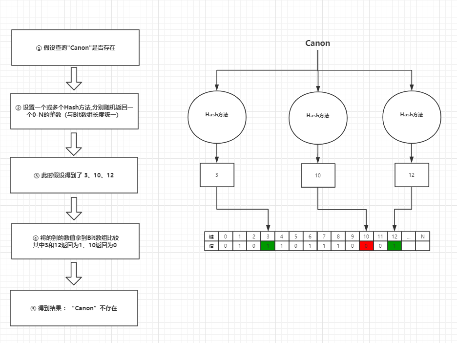

## 定义

布隆过滤器（Bloom Filter）是1970年由布隆提出的。它实际上是一个很长的二进制向量(位图)和一系列随机映射函数（哈希函数）。
布隆过滤器可以用于检索一个元素是否在一个集合中。它的优点是空间效率和查询时间都远远超过一般的算法，缺点是有一定的误识别率和删除困难。

## 场景

- 缓存穿透
- 大量数据中判断是否存在
  - 梯子PAC模式

## 图说

## 优点

- 省资源
- 查询快

## 缺点

- 无法删除（核心痛点）
- 存在错误率

## 提高正确率

- 合理控制**数组长度**和**Hash方法数量**