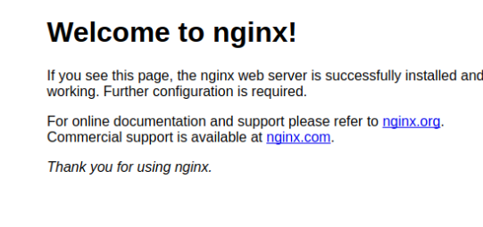
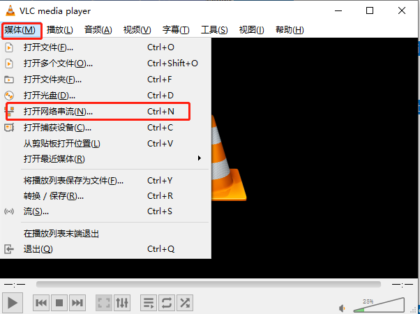
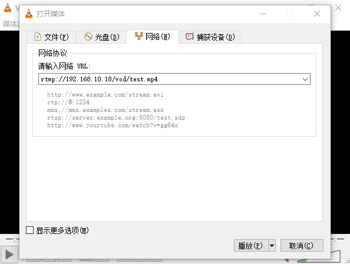
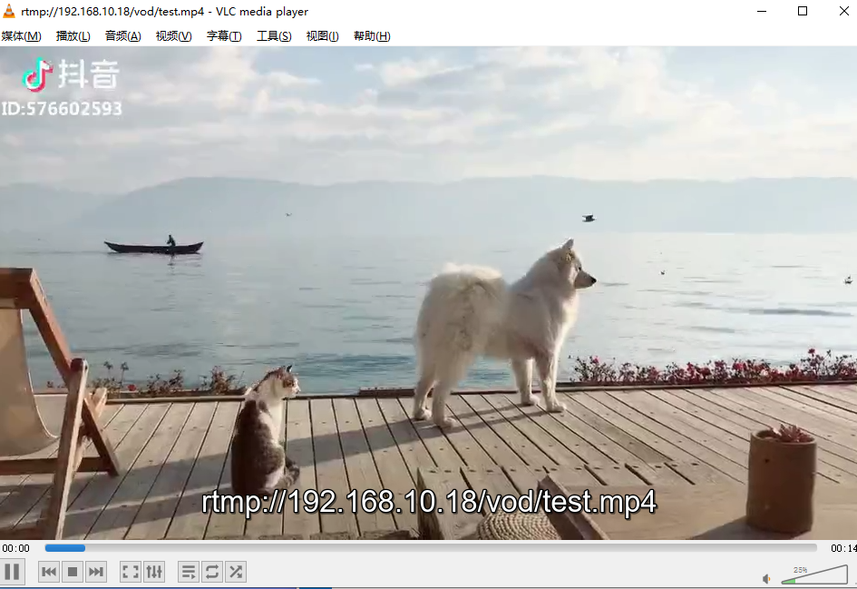

# 搭建一个Nginx+RTMP的流媒体服务器

用于教育系统中的视频模块

## 开始

需要以下食材：

* Ubuntu16.04
* [nginx-1.10.3](http://nginx.org/en/download.html) 
* [nginx-rtmp-module](https://github.com/arut/nginx-rtmp-module)

### 安装nginx服务器

- 下载安装 nginx 和 nginx-rtmp 编译依赖工具 

  ```shell
  $ sudo apt-get install build-essential libpcre3 libpcre3-dev openssl libssl-dev创
  ```

* 建一个目录，为了将下载的资源放至此处 

  ```
  $ mkdir /videos
  $ cd /videos
  ```

* 下载 nginx 和 nginx-rtmp的源码 

  ```
  $ wget http://nginx.org/download/nginx-1.10.3.tar.gz 
  $ wget https://github.com/arut/nginx-rtmp-module/archive/master.zip
  ```

- 安装unzip工具，解压下载的安装包(已安装可忽略) 

  ```
  $ sudo apt-get install unzip
  ```


- 解压 nginx 和 nginx-rtmp安装包 并切换到 nginx目录 

  ```
  $ tar -zxvf nginx-1.7.5.tar.gz
  
  $ unzip master.zip 
  
  $ cd nginx-1.7.5
  ```

* 编译安装 

  ```
  $ make sudo make install
  ```

  

* 安装成功后,运行Nginx

  ```
  cd /usr/local/nginx 
  ./sbin/nginx
  ```

  

* 浏览器访问 `localhost`



得到该结果表示安装成功


### 配置Nginx服务器

* 打开`Nginx`的配置文件

  ​	`/usr/local/nginx/conf/nginx.conf`

```nginx

#user  nobody;
worker_processes  1;


events {
    worker_connections  1024;
}

#my start 点播视频 服务器的配置
#播放地址示例: rtmp://localhost/vod/qq.mp4 注意不支持中文视频名称
rtmp {                
    server {
        listen 1935;  #//服务端口 
        chunk_size 4096;   #//数据传输块的大小

        application vod {  #vod为应用名 可自定义
            play /videos; #//视频文件存放目录。
        }
    }
}
#my end

...
```


修改了配置文件需要重启

`RTMP`文件无法直接观看需要工具,我使用的是`VLC media player`





