# 《大型网站技术架构 - 核心原理与案例》读后感（架构入门）

[TOC]

## 读后感

​	无意中在公司书架上看到的书，本来以为不是我现在可以读得懂的但是翻了几页后发现内容讲的很通俗易懂几乎没有代码都是概念，所以我抱着试一试的心态借走粗略读了一遍，希望可以借助作者之手敲开我架构方向的大门。

​	作者有一句话我印象深刻“不要企图设计一个大型网站”，我的理解就是"罗马不是一天建成的"还是从基础干起,一步步迭代才能成为一款好的产品。

## 笔记

### 大型网站的特点

1. 高并发,大流量
2. 高可用
3. 海量数据
4. 用户广泛,网络情况复杂
5. 安全环境恶劣
6. 需求快速变更,发布频繁
7. 渐进式发展

### 大型网站架构演化

#### 初始阶段网站架构

​	可能也是目前绝大多数网站的所处的情况，一台云服务器+一个LNMP环境+一份代码就组成了一个网站。

​	所有的应用程序都放在一台服务器之中

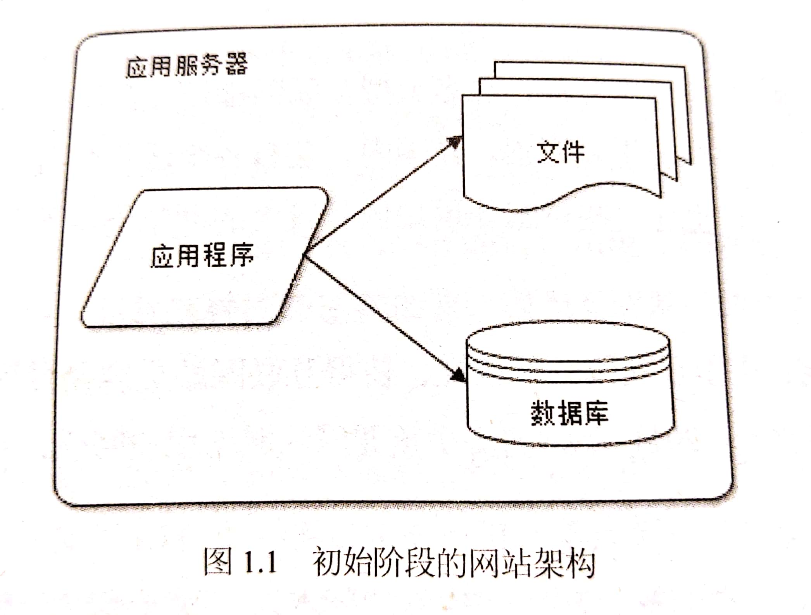

### 

#### 应用服务与数据服务

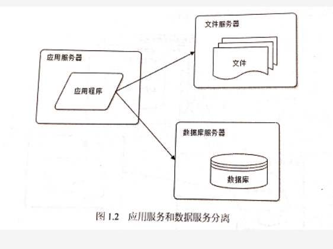

​	如上图所示这个架构已经将一个网站分为到了三台服务器上分别是：应用服务器（存放代码）、文件服务器（存放用户上传的文件）、数据库服务器（存放数据）。

​	代码、文件、数据，这三者在硬件方面要求是不同的。例如：代码有大量的业务逻所以需要强劲的CPU、数据库需要更大硬盘以及内存、文件服务需要更大的硬盘和带宽。所以三台服务器也根据场景不同选择不同的配置，在同一预算下做到最好性能的发挥。

#### 使用缓存改善网站

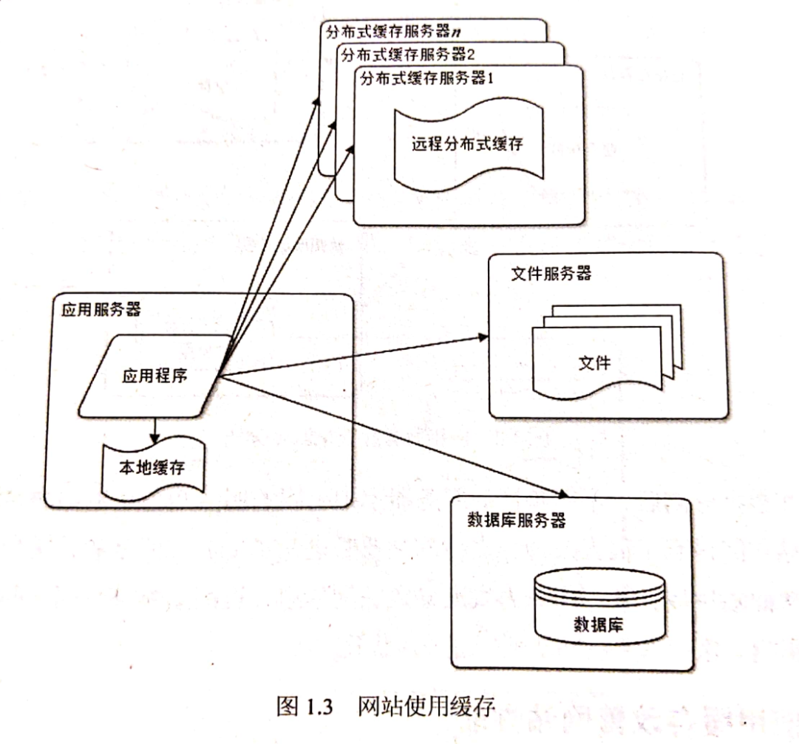

使用缓存机制，减少对数据库的访问。

#### 使用集群改善服务器对并发的处理能力

​	使用集群是网站解决高并发、海量数据最常用的方法。当一台服务器的处理能力不能达到场景需求时。不要想着升级服务器，因为大型网站不管如何升级一台服务器都难以支撑。

​	对网站而言，通过增加一台服务器的方式改善负载压力，从而实现系统可伸缩性。

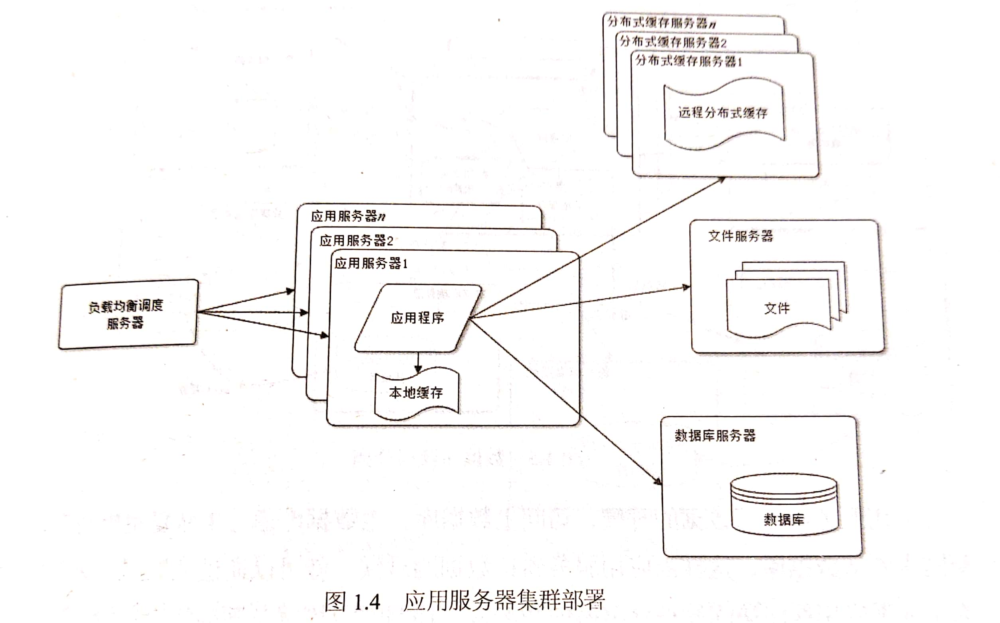

#### 读写分离

​	网站使用缓存后，绝大多数的数据都不通过数据库而是在缓存中直接读取，但是还会存在一部分读的操作以及全部的写操作。

​	目前多数主流的数据库都提供了主从备份的功能，通过配置两台数据库的主从关系，可以将一台服务器的数据更新同步到另一台。利用这一功能可以实现数据库的读写分离，从而改善数据库负载能力。

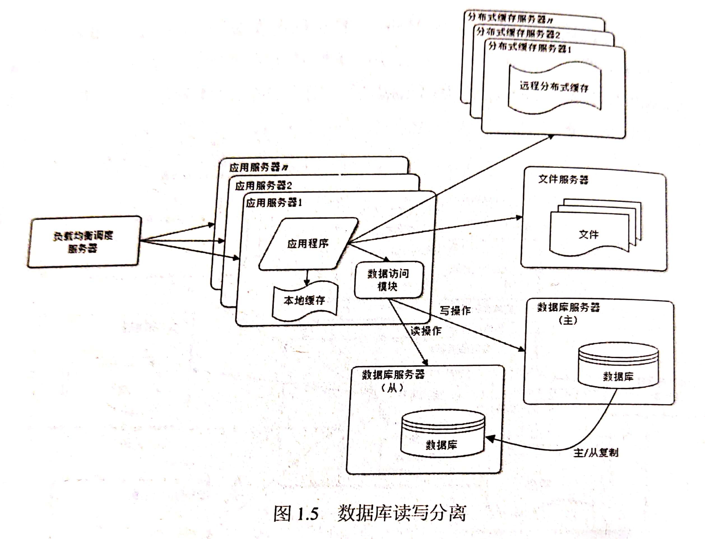

#### 使用反向代理和CDN加速网站

​	由于我国低于广阔不同地区的用户访问同一服务器的时间肯定也是不同的。

​	CDN和反向代理的基本原理都是缓存，区别在于CDN部署在网络提供商的机房，使用户请求时自动分配最近的机房获取数据。反向代理是先到达网站的中心机房，访问反向代理服务器后如果发现用户的缓存后会直接返回给用户。

#### 使用分布式文件系统和分布式数据库	

​	当一台文件系统或服务器系统无法支撑强大的用户群后就需要通过分布式进行拆分。

​	分布式数据库是网站数据拆分的最后手段，只有单表数据达到非常庞大时才需要。不到万不得已，一般会使用通过不同的业务进行数据库的拆分。

#### 使用NoSQL和搜索引擎

​	例如：Redis和Elasticsearch

#### 业务拆分

​	根据业务的实际情况，可以讲店铺、订单、积分等功能拆离，形成不同的产品线。

#### 分布式服务

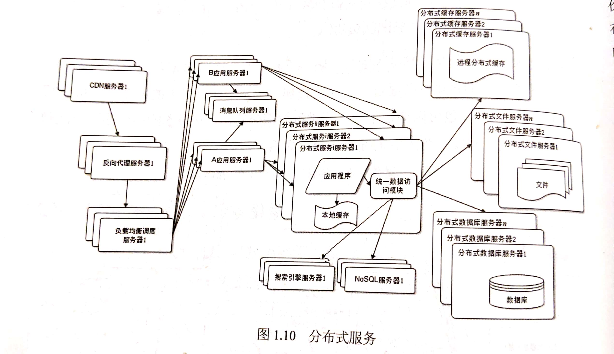

### WEB 前端性能优化

* 浏览器访问优化

  * 减少http请求

    ​	减少图片文件、JS和CSS，尽量合并

  * 使用浏览器缓存

  * 对代码、图片进行压缩

  * CSS放在最上面,JS放在最下面

    ​	页面会加载完所有CSS后才会对页面进行渲染,所以CSS要放在最上面尽快下载CSS；而JS相反。

  * 减少Cookie传输

  

### 应用服务器集群的Session管理

​	事实上业务总是有状态的（Session），负载均衡集群环境下，负载均衡服务器可能会将请求分发到集群任何依他应用服务器上，所以每次请求获取正确的Session要比单机复杂。几种手段：

1. Session复制：集群各台服务器间同步Session对象，每台服务器都保存所有用户的Session信息。服务器内存无法保存大量Session，不适合大型网站。

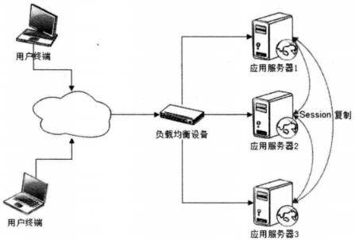

2. Session绑定：利用负载均衡的源地址Hash算法，负载均衡服务器总是将源于同一IP的请求分发到同一服务器。服务器宕机Session丢失，无法高可用，不适合大型网站。

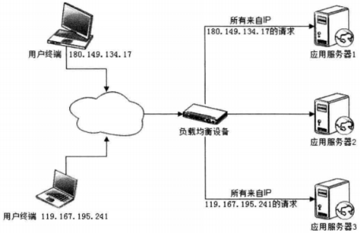

3. 利用Cookie记录Session：Cookie大小限制；每次请求响应都传输Cookie，影响性能；用户关闭Cookie将不正常。Cookie简单易用，可用性高，支持应用服务器线性伸缩，许多网站或多或少都使用Cookie记录Session。

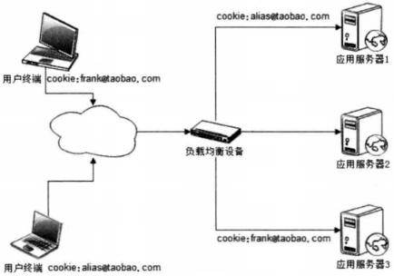

4. Session服务器：利用分布式缓存、数据库等存取Session，实现应用服务器的状态分离。可用性高、伸缩性好、性能不错，适合大型网站。

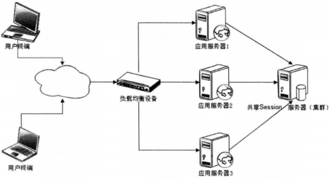

### 秒杀活动案例分析

#### 秒杀活动的技术挑战

1. 对现有网站业务造成冲击：活动时间短、并发访问量大，如果和网站原有应用部署在一起，必然对现有业务冲击。

2. 高并发下的应用、数据库负载：秒杀开始前，用户不断刷新浏览器页面保证不错过，请求如果按一般网站应用架构，会对应用服务器、数据库服务器造成极大负载。

3. 突然增加的网络及服务器带宽：假设秒杀页面大小200KB（主要是商品图片），那么所需带宽是200KB×10000=2GB。

4. 直接下单：秒杀开始前，只能浏览，不允许下单。

#### 架构设计

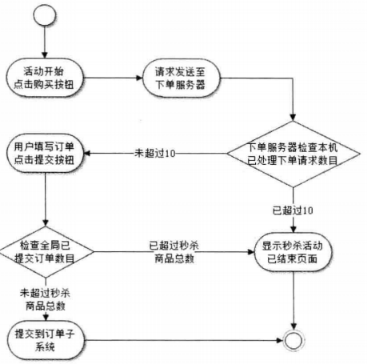

1. 秒杀系统独立部署：独立部署，甚至独立域名，使其与网站完全隔离，即使秒杀系统奔溃，也不影响网站。

2. 秒杀页面静态化：将商品描述、商品参数、成交记录和用户评价全部写入静态页面，请求无需访问应用服务器和数据库服务器。

3. 秒杀页面尽量简单：节约带宽；用户关心能否进入下单页面，而不是商品详情等用户体验细节。

4. 租借秒杀网络带宽：向运营商重新购买或租借带宽；秒杀页面缓存在CDN，需向CDN服务商临时租借新增出口带宽。

5. 动态生成随机下单页面URL：为避免用户直接访问下单页面URL，该URL必须动态化，在下单页面URL加入服务器生成的随机数作为参数，秒杀开始时才能获得。

6. 控制秒杀页面购买按钮点亮：该页面引用包含是否开始和下单页面URL随机数的JavaScript文件，秒杀开始时才生成该文件被浏览器加载。为避开缓存，该文件在CDN、反向代理服务器缓存，并使用随机版本号。

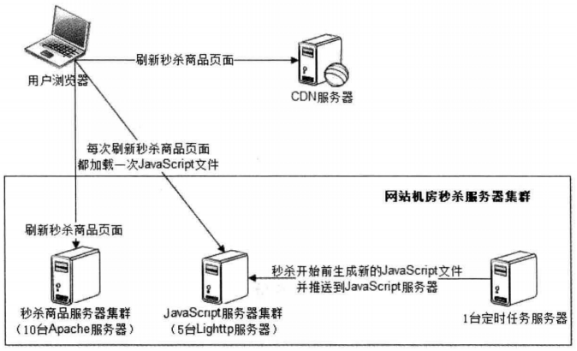

7. 只允许第一个提交的订单被发送到订单子系统：秒杀最终只有一个订单提交成功，为减轻服务器负载，可控制只有少数用户（根据集群处理能力确定个数）能进入下单页面，其他用户直接进入秒杀结束页面。

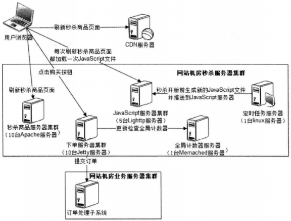

### 关系数据库集群的伸缩性设计

1. 主从复制：利用关系数据库数据复制功能，进行简单伸缩。

   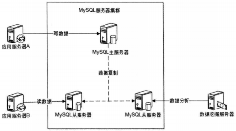

2. 分库：不同业务数据表部署在不同数据库集群上。制约条件是跨库不能join操作。

3. 分片：对某些单表数据量大的表（如Facebook用户表、淘宝商品表），将一张表拆分存储在多个数据库。

​    a) 比较成熟的支持数据分片的开源分布式关系数据库产品：Amoeba、Cobar。

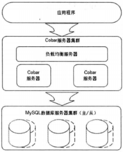

  b) 分布式关系数据库特点：限制了关系数据库某些功能；海量数据压力不得不利用分布式关系数据库伸缩。

​    c) 分布式关系数据库注意：避免事务或利用事务补偿机制代替数据库事务；分解数据访问逻辑避免join操作。

### 负载均衡

#### 负载均衡的方法

* HTTP重定向负载均衡

  * HTTP重定向服务器根据用户的HTTP请求计算一台真实Web服务器地址，将该地址写入HTTP重定向响应（状态码302）返回用户浏览器。
  *  优点：简单。
  *  缺点：浏览器两次请求服务器才能完成一次访问；302状态码重定向可能使搜索引擎判断为SEO作弊，降低搜索排名。
  * 实际：应用少。

  

  ​	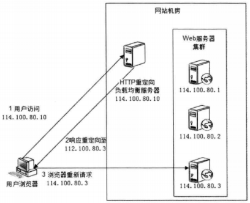

* DNS域名解析负载均衡

  * DNS服务器中配置多个A记录（如www.mysite.com IN A 114.100.80.1、www.mysite.com IN A 114.100.80.2、www.mysite.com IN A 114.100.80.3），每次域名解析请求都会根据负载均衡算法计算一个IP地址返回。
  * 优点：负载均衡交给DNS，省去维护负载均衡服务器的麻烦；DNS支持基于地理位置的解析，即解析距离用户最近的服务器地址。

  - 缺点：服务器下线时，更新DNS解析生效时间较长；DNS负载均衡控制权在域名服务商，无法对其更多改善和管理。

  - 实际：大型网站使用DNS解析作为第一级负载均衡，即解析得到的一组服务器是内部负载均衡服务器，再由内部负载均衡服务器分发到真是Web服务器

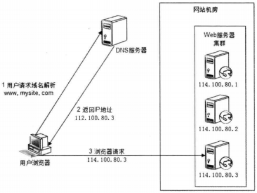

* 反向代理负载均衡
  * 反向代理同时实现了缓存和负载均衡功能；Web服务器不使用外部IP地址，由反向代理服务器配置双网卡和内外两套IP地址。
  * 优点：反向代理服务器功能集中，部署简单。
  * 缺点：反向代理服务器是所有请求的响应的中转站，性能可能成为瓶颈。

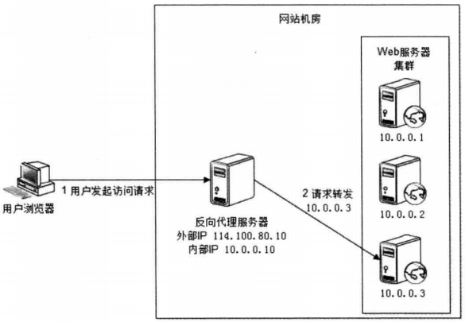

* IP负载均衡

  * 负载均衡服务器114.10.80.10在操作系统内核进程获取网络数据包，根据负载均衡算法计算得到一台Web服务器10.0.0.1，再将数据目的IP地址修改为10.0.0.1，无需用户进程处理；Web服务器10.0.0.1响应后，负载均衡服务器再将数据包源地址修改为自身IP地址114.10.80.10，发送给浏览器。
  * 优点：在内核进程完成数据分发，较反向代理负载均衡（应用程序分发）性能更好。
  *  缺点：与反向代理负载均衡相同。

  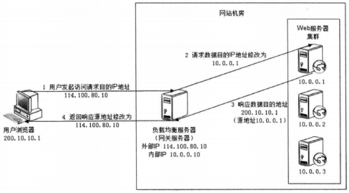

  

* 数据链路层负载均衡

  * 原理：三角传输模式；直接路由方式（DR）；负载均衡服务器只在数据链路层修改目的MAC地址，配置真实物理服务器所有机器虚拟IP与负载均衡服务器IP地址一致，即可不修改数据包源地址和目的地址进行分发；真实物理服务器IP与数据请求目的IP一致，无需通过负载均衡服务器就可响应数据返回浏览器。

  *  优点：避免负载均衡服务器成为瓶颈。

  * 实际：大型网站使用最广的负载均衡。Linux上最好的开源产品是LVS（Linux Virtual Server）。

    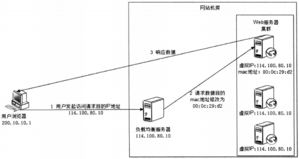

  

  

  ##### 负载均衡算法

  1. 轮询（Round Robin，RR）：所有请求依次分发到每台服务器，适合所有服务器硬件都相同的场景。

  2. 加权轮询（Weight Round Robin，WRR）：轮询基础上，按照配置的权重将请求分发到每台服务器，高性能的服务器分配更多请求。

  3. 随机（Random）：请求随机分发到每台服务器，也可加权随机。

  4. 最少连接（Least Connections）：记录每台服务器正在处理请求（连接）数，将新请求分发到最少连接服务器，最符合负载均衡定义，也可加权最少连接。

  5. 源地址散列（Source Hashing）：根据请求来源IP地址的Hash值，得到服务器，同一IP地址请求总在一台服务器上处理。

## 参考

《大型网站技术架构 - 核心原理与案例》-  李智慧  [电子工业出版社]

[CnBlogs - netoxi](https://www.cnblogs.com/netoxi/p/7258895.html)

[csdn huzanhe](https://blog.csdn.net/huzanhe/article/details/78975038)