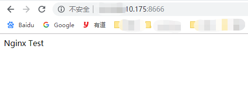

# 记一次Docker通过Nginx部署静态页面

## 前言

​	Docker容器也使用一阵子了,一直是通过Ubuntu的镜像进行环境的搭建,就是这样感觉和虚拟机差不多。所以尝试容器不通过Ubuntu为载体去部署WEB环境。

​	我继续使用了我的云服务器（Ubuntu 16.04）

​	插一嘴：部署前搜了很多关于Nginx搭建静态页面的教程或文章，选了排名靠前的文章一步步跟着做...但是！出现了不同的问题，所以排除问题后决定汲取经验认真写一篇。

## 开始

### 首先在仓库拉取一个nginx镜像

```shell
$ docker pull nginx
```


### 创建挂在目录

方便对配置文件及WEB文件进行修改和上传

```shell
$ mkdir -p /data/nginx/{conf,conf.d,html,logs}
```


### 配置Nginx

``$ vim /data/conf/nginx.conf``

```nginx
user  nginx;
worker_processes  1;

error_log  /var/log/nginx/error.log warn;
pid        /var/run/nginx.pid;


events {
    worker_connections  1024;
}


http {
    include       /etc/nginx/mime.types;
    default_type  application/octet-stream;

    log_format  main  '$remote_addr - $remote_user [$time_local] "$request" '
                      '$status $body_bytes_sent "$http_referer" '
                      '"$http_user_agent" "$http_x_forwarded_for"';

    access_log  /var/log/nginx/access.log  main;

    sendfile        on;
    #tcp_nopush     on;

    keepalive_timeout  65;

    #gzip  on;

    include /etc/nginx/conf.d/*.conf;
}

```


``$ vim /data/nginx/conf.d/default.conf``

```nginx
server{ 
    listen       80;  
    server_name  localhost;  
  
    #charset koi8-r;  
    #access_log  /var/log/nginx/log/host.access.log  main;  
  
    location / {  
        # root   /data/nginx/html;  
        root   /usr/share/nginx/html; 
        index  index.html index.htm;  
        autoindex  on;  
        try_files $uri $uri/ =404;
        #try_files $uri /index/map/page.html;  
    }  
  
    #error_page  404              /404.html;  
  
    # redirect server error pages to the static page /50x.html  
    #  
    error_page   500 502 503 504  /50x.html;  
    location = /50x.html {  
        root   /usr/share/nginx/html;  
    }  
  
    # proxy the PHP scripts to Apache listening on 127.0.0.1:80  
    #  
    #location ~ \.php$ {  
    #    proxy_pass   http://127.0.0.1;  
    #}  
  
    # pass the PHP scripts to FastCGI server listening on 127.0.0.1:9000  
    #  
    #location ~ \.php$ {  
    #    root           html;  
    #    fastcgi_pass   127.0.0.1:9000;  
    #    fastcgi_index  index.php;  
    #    fastcgi_param  SCRIPT_FILENAME  /scripts$fastcgi_script_name;  
    #    include        fastcgi_params;  
    #}  
  
    # deny access to .htaccess files, if Apache's document root  
    # concurs with nginx's one  
    #  
    #location ~ /\.ht {  
    #    deny  all;  
    #}  
}

```


### 常见WEB文件

​	在``/data/nginx/html``下创建一个``index.html``文件，至于内容随便写写就好了。


### 运行容器

```shell
$ docker run \
--name mynginx \
-d \
-p 8666:80 \
-v /data/nginx/html:/usr/share/nginx/html \
-v /data/nginx/conf/nginx.conf:/etc/nginx/nginx.conf \
-v /data/nginx/logs:/var/log/nginx \
-v /data/nginx/conf.d:/etc/nginx/conf.d \
-d nginx:latest
```

​	参数也很简单，就是把容器的80映射到宿主机的8666端口；四个``-V``是将刚才创建的文件挂载至nginx在容器内制定路径。

​	随后可以 ``docker ps``查看下我们创建的Nginx容器。

```shell
root@VM-5081a8c9-c5b5-42ad-ab3a-2dd9e6a9399d:/# docker ps
CONTAINER ID        IMAGE               COMMAND                  CREATED             STATUS              PORTS                                          NAMES
b161278197c9        nginx:latest        "nginx -g 'daemon of…"   30 minutes ago      Up 30 minutes       0.0.0.0:8666->80/tcp
```

​	目前看来还是比较成功的。


###  浏览器测试



**效果完美~**


## 关于我遇到的坑

- **后无响应，ping不到**

  ​	嘿嘿，由于是云服务器服务商都设置了端口规则，后台开放了我的``8666``端口就解决了。

- **500错误**

  ​	出现了500感觉也算是成功了一半，由于Nginx配置都是网上复制的所以怀疑是配置问题。	

  ​	所以打开``/data/nginx/logs/error.log``看下日志。

  ```nginx
  2019/04/19 09:00:00 [error] 6#6: *1 rewrite or internal redirection cycle while internally redirecting to "/index/index/page.html", client: xxx.xxx.xxx.xx, server: localhost, request: "GET / HTTP/1.1", host: "xxxxxx:8666"
  ```

  ​	一顿谷歌后找到解决方法，修改``/data/nginx/conf.d/default.conf``文件

  

  ```nginx
   location / {
       root   /data/nginx/html;   
       index  index.html index.htm; 
       autoindex  on;
       try_files $uri /index/index/page.html;
  }
  
  # 修改为
  
  location / {  
          root   /data/nginx/html;   
          index  index.html index.htm;  
          autoindex  on;  
          try_files $uri $uri/ =404;
  }  
  ```


- **404错误**

  ​	很显然是html文件没找到，矛头又指向配置文件

  ​	

  ```nginx
  location / {  
          root   /data/nginx/html;   
          index  index.html index.htm;  
          autoindex  on;  
          try_files $uri $uri/ =404;
  }  
  
  # 修改为
  
  location / {  
          # root   /data/nginx/html;  
          root   /usr/share/nginx/html; 
          index  index.html index.htm;  
          autoindex  on;  
          try_files $uri $uri/ =404;
          #try_files $uri /index/map/page.html;  
   }  
  ```

  

开始我还在纠结``default.conf``中的`` listen  ``是填写``80``还是``8666``，仔细想过后Nginx终究还是运行在容器中的，默认还是``80``端口只不过是将 他映射在了宿主的``8666``上。

所以对于html路径也是同理，``/data/nginx/html``只是映射在宿主的地址，在容器内Nginx还是去默认的``/usr/share/nginx/html``路径寻找Web文件。

