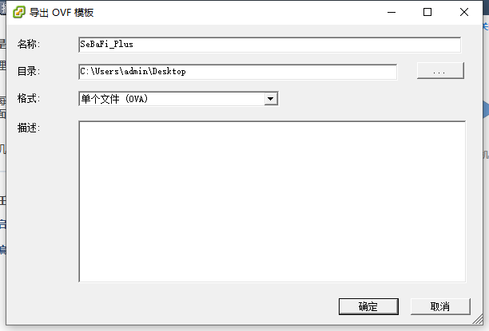
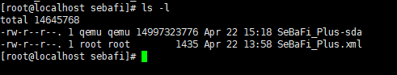
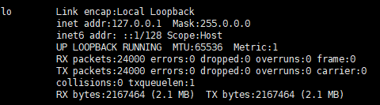
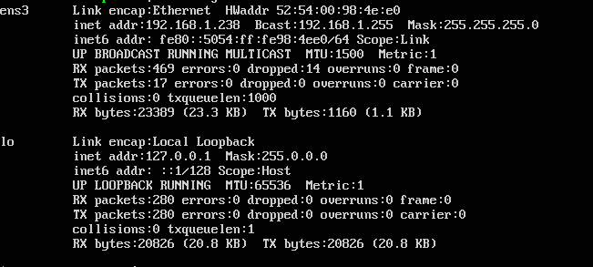

# 记一次ESXI转KVM

​	KVM环境已经搭建完成,下面需要把原有项目导到KVM中。因为重新配置系统还是需要点时间的，如果能转格式肯定是极好的。

​	因为之前遇到过H3C的虚拟化软件环境转到VMware结果是没有办法 ,自以为就几乎不可能了,百度后才发现世界原来那么大...

## 开始

1. 首先将镜像导为OVA格式

打开``VMware vSphere Client``,关闭服务器后点击 **文件** > **导出** > **导出OVF模板**。



* 剧透一嘴：

  * 导出的格式一定是 **单个文件（OVA）**；

  * 文件名称不要花里胡哨，亲测使用特殊符号后转换格式时会出现找不到文件的情况；

    > [ERROR] virt-v2v: error: -i ova: OVF references file ‘SeBaFi_Plus%23D-disk1.vmdk’ which was not found in the OVA archive

随后将OVA文件放置在KVM环境下(任意文件夹下即可)


## V2V工具

```shell
$ yum install virt-v2v
```


安装成功后开始创建镜像文件夹

```shell
$ virt-v2v -i ova 镜像名称.ova -o local -os /home/vm1/sebafi  -of qcow2 
```

执行：

>[   0.0] Opening the source -i ova SeBaFi_Plus.ova
>virt-v2v: warning: making OVA directory public readable to work around 
>libvirt bug https://bugzilla.redhat.com/1045069
>[  23.1] Creating an overlay to protect the source from being modified
>[  23.4] Initializing the target -o local -os /home/vm1/sebafi
>[  23.4] Opening the overlay
>[  41.4] Inspecting the overlay
>[  57.5] Checking for sufficient free disk space in the guest
>[  57.5] Estimating space required on target for each disk
>[  57.5] Converting CentOS release 6.9 (Final) to run on KVM
>virt-v2v: This guest has virtio drivers installed.
>[ 178.6] Mapping filesystem data to avoid copying unused and blank areas
>[ 178.9] Closing the overlay
>[ 179.4] Checking if the guest needs BIOS or UEFI to boot
>[ 179.4] Assigning disks to buses
>[ 179.4] Copying disk 1/1 to /home/vm1/sebafi/SeBaFi_Plus-v2v-sda (qcow2)
>    (100.00/100%)
>[ 216.1] Creating output metadata
>[ 216.1] Finishing off

完成后在``/home/vm1/sebafi``文件夹下会多出两个新文件



``SeBaFi_Plus.xml``文件就是KVM的配置文件，随后也将由他生成新的虚拟机。

``SeBaFi_Plus-sda``文件是镜像文件，XML文件中会有选项指向它。

```XML
<disk type='file' device='disk'>
    <driver name='qemu' type='qcow2' cache='none'/>
    <source file='/home/vm1/sebafi/SeBaFi_Plus-sda'/>
    <target dev='vda' bus='virtio'/>
</disk>
```


## 修改配置文件

打开``SeBaFi_Plus.xml``文件 做一些基本的修改。

* 网卡配置
  * 修改网卡``source`` network 为桥接
  * 修改网卡使用virtio
* 虚拟机名称
* 硬件配置（CPU、内存等）

示例：

```xml
<?xml version='1.0' encoding='utf-8'?>
<domain type='kvm'>
  <!-- generated by virt-v2v 1.38.2rhel=7,release=12.el7_6.2,libvirt -->
  <!--虚拟机名称-->
  <name>sebafi</name>
  <!--硬件配置-->
  <memory unit='KiB'>1048576</memory>
  <currentMemory unit='KiB'>1048576</currentMemory>
  <vcpu>1</vcpu>
  <features>
    <acpi/>
    <apic/>
  </features>
  <os>
    <type arch='x86_64'>hvm</type>
  </os>
  <on_poweroff>destroy</on_poweroff>
  <on_reboot>restart</on_reboot>
  <on_crash>restart</on_crash>
  <devices>
    <disk type='file' device='disk'>
      <driver name='qemu' type='qcow2' cache='none'/>
      <source file='/home/vm1/sebafi/SeBaFi_Plus-sda'/>
      <target dev='vda' bus='virtio'/>
    </disk>
    <disk device='cdrom' type='file'>
      <driver name='qemu' type='raw'/>
      <target dev='sda' bus='scsi'/>
    </disk>
    <!--网卡配置-->
    <interface type='bridge'>
      <source bridge='br0'/>
      <target dev='virtio'/>
      <address type='pci' domain='0x0000' bus='0x00' slot='0x03' function='0x0'/>
    </interface>
    <!--网卡配置-->
    <video>
      <model type='qxl' ram='65536' heads='1'/>
    </video>
    <graphics type='vnc' autoport='yes' port='-1'/>
    <rng model='virtio'>
      <backend model='random'>/dev/urandom</backend>
    </rng>
    <memballoon model='virtio'/>
    <panic model='isa'>
      <address type='isa' iobase='0x505'/>
    </panic>
    <input type='tablet' bus='usb'/>
    <input type='mouse' bus='ps2'/>
    <console type='pty'/>
  </devices>
</domain>

```


## 导入虚拟机

* 通过xml导入虚拟机

  ```SHELL
  # cd /home/vm1/sebafi/
  $ virsh  define centos-dev-test01-v2v.xml  
  # Domain sebafi defined from SeBaFi_Plus.xml 【得到这句话就代表成功啦】
  ```


* 查看虚拟机

  ```
  virsh list --all
  ```

  得到结果：

	> Id    Name                           State
	>
	> 8     test14                          running
	> 9     test141                        running
	> 6     sebafi                          shut off


## 关于桥连的问题

​	进入到虚拟机后我以为以及结束了，但是后来才发现**虚拟机！没！有！网！**

​	``ifconfig`` 后只得到了内网ip



​	但是``ifconfig -a`` 却又出现一个ens3,但是同样没又IP地址



​		(这是解决后的图，因为是先操作后写文章所以就 - -！ )

​	解决方法 ：

​	一顿操(bai)作(du)猛如虎之后，尝试了一下 ``ifconfig ens3 192.168.1.238``,结果发现``ifconfig ``下有了IP地址,浏览器访问也看到了之前的网站...

​	但是这个命令也只是临时的,重启后就没了,所以还要给虚拟机一个静态的IP

```
# sudo vi /etc/network/interfaces
# 在最下面添加了

#ens3
auto ens3
iface ens3 inet static
address 192.168.1.238

```

保存,重启

发现IP还存在,完美解决


撒花...


## 参考

[ESXI 迁移至KVM (V2V迁移) - 惨绿少年 - 博客园](https://www.cnblogs.com/clsn/p/8510670.html)

[ubuntu修改IP地址和网关的方法 - 小 楼 一 夜 听 春 雨 - 博客园](https://www.cnblogs.com/kex1n/p/5195825.html)

[V2V迁移测试--VMware/VSphere环境迁移至KVM - minxihou的博客 - CSDN博客](https://blog.csdn.net/minxihou/article/details/52950125)

感谢大佬们文章...