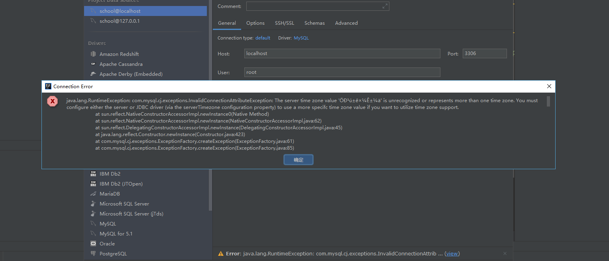

## 报错内容



```java
java.lang.RuntimeException: com.mysql.cj.exceptions.InvalidConnectionAttributeException: The server time zone value 'Öйú±ê׼ʱ¼ä' is unrecognized or represents more than one time zone. You must configure either the server or JDBC driver (via the serverTimezone configuration property) to use a more specifc time zone value if you want to utilize time zone support.
	at sun.reflect.NativeConstructorAccessorImpl.newInstance0(Native Method)
	at sun.reflect.NativeConstructorAccessorImpl.newInstance(NativeConstructorAccessorImpl.java:62)
	at sun.reflect.DelegatingConstructorAccessorImpl.newInstance(DelegatingConstructorAccessorImpl.java:45)
	at java.lang.reflect.Constructor.newInstance(Constructor.java:423)
	at com.mysql.cj.exceptions.ExceptionFactory.createException(ExceptionFactory.java:61)
	at com.mysql.cj.exceptions.ExceptionFactory.createException(ExceptionFactory.java:85)
```


## 解决方法：

在设置的URL中添加时区的参数	

`serverTimezone=UTC`

例：`jdbc:mysql://localhost:3306/school?serverTimezone=UTC`

